# 软件设计说明书 (SDD)

## Software Design Description

> 本文档遵循 **IEEE Std 1016-2009** 标准编写

---

## 文档标识信息

| 项目 | 内容 |
| :--- | :--- |
| **项目名称** | 中国移动智慧合同管理系统 (CMCC Intelligent Contract Management System) |
| **文档标题** | 软件设计说明书 (Software Design Description) |
| **文档版本** | v1.2 |
| **文档状态** | 正式发布 (Released) |
| **发布日期** | 2025年12月31日 |
| **发布组织** | 第36组开发团队 |
| **作者** | 李星烁、许奕、肖相宇、张洛梧 |
| **版权声明** | © 2025 软件工程课程项目组，保留所有权利 |

---

## 文档修订历史

| 版本 | 日期 | 修改人 | 变更说明 |
| :--- | :--- | :--- | :--- |
| v1.0 | 2025-12-22 | 架构组 | 初始版本发布 |
| v1.1 | 2025-12-31 | 架构组 | 按照IEEE 1016-2009标准重构文档结构；新增设计涉众与关注点章节；新增设计视点定义章节；完善设计视图内容 |
| v1.2 | 2025-12-31 | 架构组 | 与SRS v2.1完全对齐；确认合同变更、组织四级架构和审批规则的一致性 |

---

## 目录

## 1. 引言 (Introduction)

### 1.1 编写目的

本软件设计说明书（Software Design Specification, SDS）旨在详细描述**中国移动智慧合同管理系统**的系统架构、模块设计、接口定义及数据库设计。本文档基于《软件需求规格说明书（SRS）v2.0》编写，是将业务需求转化为技术实现的蓝图。

本文档的主要预期读者包括：
- **系统架构师**：用于指导系统整体架构搭建与技术选型。
- **后端开发人员**：用于理解业务逻辑实现、数据库结构及接口规范。
- **前端开发人员**：用于理解页面交互逻辑及API调用方式。
- **AI算法工程师**：用于理解AI服务与业务系统的集成方式及数据流转。
- **测试人员**：用于编写集成测试用例和系统测试方案。

### 1.2 项目背景与范围

本项目旨在为中国移动开发一套智能化的合同管理系统，解决传统合同管理中起草效率低、审查依赖人工、审批流程僵化等痛点。系统聚焦于**Type A（工程施工合同）、Type B（代维服务合同）、Type C（IT服务合同）**三类核心合同，利用大语言模型（LLM）和检索增强生成（RAG）技术，实现合同的智能起草与风险审查。

**系统范围包括**：
- **前端子系统**：提供用户交互界面，包括合同管理、审批工作台、仪表盘等。
- **后端子系统**：处理核心业务逻辑，包括用户权限、工作流引擎、合同全生命周期管理。
- **AI服务子系统**：提供基于向量数据库的知识检索、合同生成及风险审查API。
- **数据库**：存储结构化业务数据（MySQL）及非结构化向量数据（ChromaDB）。

### 1.3 参考资料

1. 《中国移动智慧合同管理系统 - 软件需求规格说明书 (SRS) v2.0》
2. 《阿里巴巴Java开发手册（泰山版）》
3. Spring Boot 3.x 官方文档
4. Vue.js 3.x 官方文档
5. FastAPI 官方文档

### 1.4 术语与缩略语定义

| 术语/缩略语 | 全称 | 说明 |
| :--- | :--- | :--- |
| **SDD** | Software Design Specification | 软件设计说明书 |
| **SRS** | Software Requirements Specification | 软件需求规格说明书 |
| **RAG** | Retrieval-Augmented Generation | 检索增强生成，结合外部知识库增强LLM能力的技术 |
| **LLM** | Large Language Model | 大语言模型（如通义千问 Qwen） |
| **RBAC** | Role-Based Access Control | 基于角色的访问控制 |
| **DTO** | Data Transfer Object | 数据传输对象，用于层间数据传输 |
| **VO** | View Object | 视图对象，用于展示层数据封装 |
| **PO** | Persistent Object | 持久化对象，与数据库表一一对应 |
| **Pre-Flight Check** | - | 提交前审查规则引擎，用于硬性规则校验 |

---

## 2. 设计涉众与关注点 (Design Stakeholders and Concerns)

> 本章依据 IEEE Std 1016-2009 第4.3节要求编写，明确识别设计涉众并声明其设计关注点。

### 2.1 设计涉众识别

本系统的设计涉众（Design Stakeholders）是指对系统设计有利益关系或关注点的个人、组织或群体。根据系统特点，识别以下核心涉众：

| 涉众类型 | 具体角色 | 描述 |
| :--- | :--- | :--- |
| **开发团队** | 系统架构师 | 负责系统整体架构设计与技术选型 |
| | 后端开发人员 | 负责业务逻辑实现、数据库设计与API开发 |
| | 前端开发人员 | 负责用户界面开发与交互设计 |
| | AI算法工程师 | 负责AI服务开发、知识库构建与模型集成 |
| **测试团队** | 测试人员 | 负责编写测试用例、执行测试与缺陷跟踪 |
| **运维团队** | 系统管理员 | 负责系统部署、监控与日常维护 |
| **业务用户** | 项目经理（网络部/运维部/IT部） | 创建和管理Type A/B/C合同 |
| | 法务人员 | 审查合同法律风险、执行AI合规审查 |
| | 审批领导 | 审批合同任务、查看风险报告 |
| | 流程管理员 | 配置审批流程模板、管理流程定义 |
| **管理层** | 课程指导教师 | 验证系统功能与评估项目质量 |

### 2.2 设计关注点声明

每个涉众对系统设计有不同的关注点（Design Concerns）。本SDD需确保这些关注点通过适当的设计视图得到满足：

| 涉众 | 设计关注点 | 对应设计视图 |
| :--- | :--- | :--- |
| **系统架构师** | 系统分层、模块划分、子系统交互、技术选型、设计模式应用 | 上下文视图、组合视图、依赖视图 |
| **后端开发人员** | 类结构设计、API接口定义、数据库Schema、业务逻辑算法 | 逻辑视图、接口视图、信息视图、算法视图 |
| **前端开发人员** | 页面组件结构、API调用方式、状态管理、用户交互流程 | 接口视图、交互视图 |
| **AI算法工程师** | AI服务架构、知识库结构、RAG流程、与主系统集成方式 | 组合视图、交互视图 |
| **测试人员** | 模块边界、接口契约、状态转换、可测试性设计 | 状态动态视图、接口视图 |
| **系统管理员** | 部署架构、资源需求、配置管理、监控指标 | 资源视图 |
| **项目经理/业务用户** | 功能完整性、操作流程、响应性能 | 上下文视图、交互视图 |
| **法务/审批人员** | 审批流程清晰性、风险审查机制、数据安全 | 状态动态视图、信息视图 |
| **流程管理员** | 流程配置灵活性、审批策略可扩展性 | 模式使用视图 |

### 2.3 关注点与IEEE设计视图映射

根据IEEE Std 1016-2009标准定义的12种设计视点，本SDD选择以下视点来覆盖所有涉众关注点：

| IEEE设计视点 | 本SDD对应章节 | 覆盖的关注点 |
| :--- | :--- | :--- |
| Context Viewpoint（上下文视点） | 3.2 系统逻辑架构 | 系统边界、外部交互、服务提供 |
| Composition Viewpoint（组合视点） | 4. 系统功能模块设计 | 模块划分、子系统组成、职责分配 |
| Logical Viewpoint（逻辑视点） | 5. 子系统详细设计 | 类结构、接口关系、继承层次 |
| Dependency Viewpoint（依赖视点） | 3.4 物理部署架构 | 模块间依赖、服务调用关系 |
| Information Viewpoint（信息视点） | 6. 数据库设计 | 数据结构、持久化、ER关系 |
| Interface Viewpoint（接口视点） | 7. 接口设计 | API定义、调用规范、数据格式 |
| Interaction Viewpoint（交互视点） | 5.3 交互时序设计 | 对象通信、消息传递、时序逻辑 |
| State Dynamics Viewpoint（状态动态视点） | 4.3.1 合同状态机 | 状态转换、事件触发、生命周期 |
| Algorithm Viewpoint（算法视点） | 审批流程引擎设计 | 处理逻辑、路由算法、规则引擎 |
| Resource Viewpoint（资源视点） | 9. 非功能性设计 | 性能指标、资源需求、容量规划 |
| Patterns Use Viewpoint（模式使用视点） | 4.3.2 设计模式应用 | 策略模式、工厂模式等 |
| Structure Viewpoint（结构视点） | 5. 子系统详细设计 | 内部组成、组件结构 |

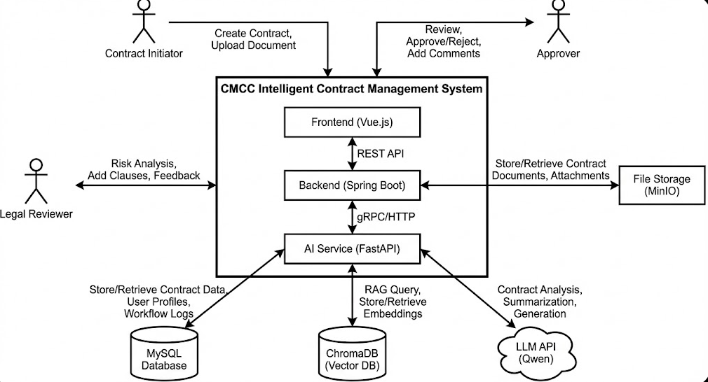

---

## 3. 系统总体设计 (System Architecture)

### 3.1 设计原则

1.  **高内聚低耦合**：各子系统（前端、后端、AI服务）独立部署，通过标准RESTful API通信。
2.  **安全性优先**：鉴于电信行业数据的敏感性，系统采用JWT认证、RBAC权限控制及数据加密传输。
3.  **可扩展性**：工作流引擎采用配置化设计，支持通过修改配置适配不同类型的审批流程；AI服务采用插件式架构，便于更换底层模型。
4.  **领域驱动设计 (DDD)**：核心业务逻辑围绕“合同”这一聚合根展开，确保业务逻辑的纯净性。

### 3.2 系统逻辑架构 (Logical Architecture)

系统采用经典的分层架构，自下而上分为数据层、基础设施层、核心服务层、应用层及展示层。

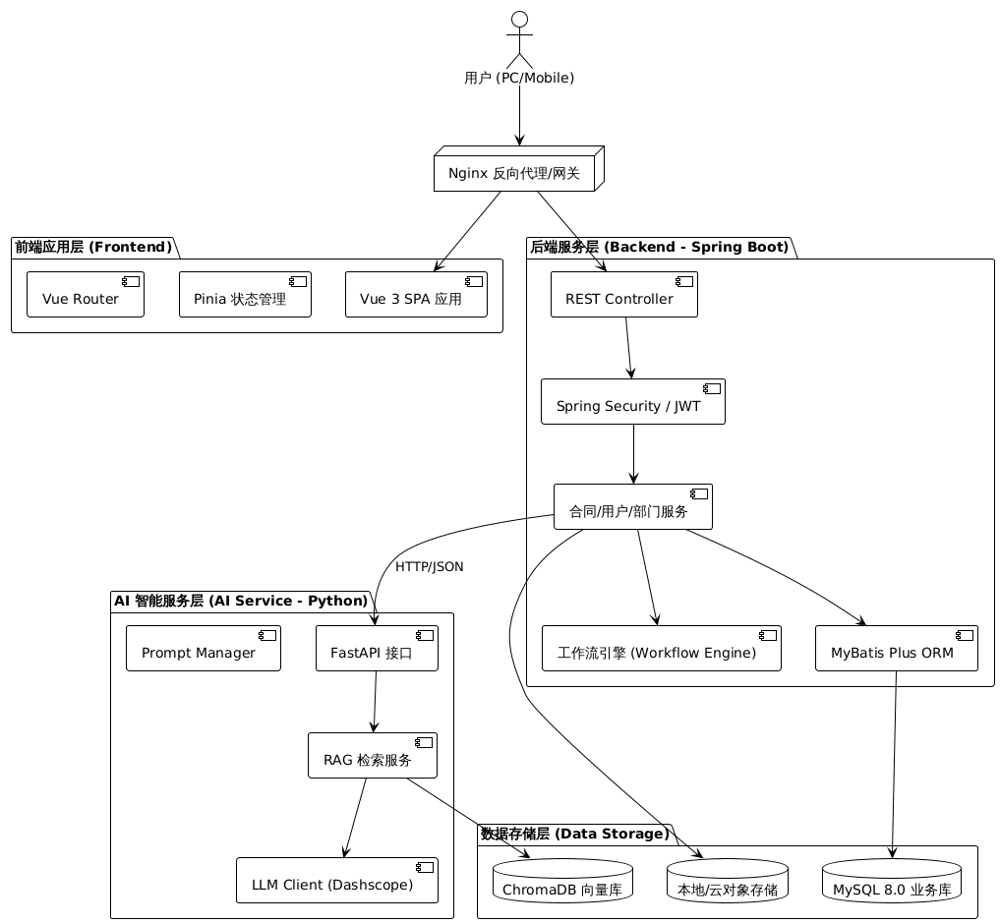


### 3.3 技术架构选型 (Technology Stack)

#### 3.3.1 前端技术栈
-   **框架**: Vue.js 3.x (Composition API)
-   **构建工具**: Vite
-   **语言**: TypeScript
-   **UI 组件库**: Element Plus
-   **状态管理**: Pinia
-   **路由管理**: Vue Router
-   **HTTP 客户端**: Axios

#### 3.3.2 后端技术栈
-   **开发语言**: Java 21
-   **核心框架**: Spring Boot 3.5.6
-   **ORM 框架**: MyBatis Plus
-   **安全框架**: Spring Security + JWT
-   **API 文档**: Knife4j / Swagger
-   **工具库**: Hutool, Lombok

#### 3.3.3 AI 服务技术栈
-   **框架**: FastAPI (Python 3.10+)
-   **服务器**: Uvicorn
-   **大模型接口**: Aliyun Dashscope (通义千问)
-   **向量数据库**: ChromaDB
-   **Embedding 模型**: Sentence-Transformers
-   **文档处理**: PyPDF2, python-docx

#### 3.3.4 数据存储与环境
-   **关系型数据库**: MySQL 8.0+
-   **运行环境**: JDK 21, Python 3.10+, Node.js 20.19.0+

### 3.4 物理部署架构 (Deployment Architecture)

系统支持容器化部署，建议采用 Docker Compose 或 K8s 进行编排。

-   **Web Server**: Nginx 作为统一入口，负责静态资源托管及 API 请求转发。
-   **App Server**: Spring Boot 应用容器，运行核心业务逻辑。
-   **AI Server**: Python 应用容器，运行 AI 推理与检索服务，需配置 GPU 或高性能 CPU 资源。
-   **Database**: MySQL 容器与 ChromaDB 容器，挂载持久化存储卷。

各服务间通过内部虚拟网络通信，仅 Nginx 端口对外暴露（如 80/443），保障内部服务安全。

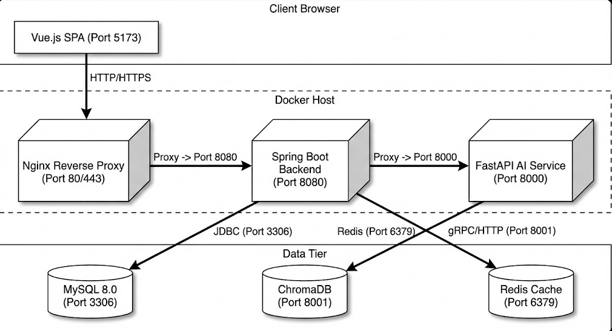

### 3.5 系统部署方案 (System Deployment)

#### 3.5.1 部署环境要求

系统部署要求如下：

**硬件要求：**
- CPU：4核心及以上（推荐8核心，AI服务计算密集）
- 内存：8GB及以上（推荐16GB，AI服务需要较大内存运行模型）
- 磁盘：50GB及以上可用空间（用于Docker镜像、数据持久化存储）
- 网络：需可访问互联网（用于下载依赖包和调用AI API）

**软件要求：**
- 操作系统：Linux（Ubuntu 20.04+ / CentOS 7+ / Debian 10+）
- Docker：20.10.0+（容器运行时）
- Docker Compose：2.0.0+（容器编排工具）
- Git：2.0.0+（代码版本管理）

**端口配置：**
- 80/443：Nginx对外服务端口（HTTP/HTTPS）
- 3306：MySQL数据库端口（仅内部Docker网络访问）
- 22：SSH管理端口

#### 3.5.2 容器化部署架构

系统采用Docker Compose进行容器编排部署，部署架构如下：

**服务组件：**
1. **nginx**：Nginx反向代理服务器，作为统一入口，负责静态资源托管及API请求转发
2. **backend**：Spring Boot应用服务容器，运行核心业务逻辑
3. **frontend**：Vue 3前端应用，构建为静态文件，由Nginx托管
4. **ai-service**：FastAPI AI服务容器，运行AI推理与检索服务
5. **mysql**：MySQL 8.0数据库容器，存储业务数据
6. **chromadb**：向量数据库（通过Python服务内嵌实现）

**网络架构：**
- 所有服务运行在Docker内部网络（bridge模式）
- 仅Nginx容器映射80/443端口到宿主机，其他服务不直接暴露
- 服务间通过Docker服务名（如`backend`、`ai-service`）进行内部通信
- 通过环境变量配置数据库连接、AI服务地址等

**数据持久化：**
- MySQL数据通过Docker volume `mysql_data`持久化
- ChromaDB向量数据通过volume `chromadb_data`持久化
- 前端构建产物通过volume `frontend_dist`共享给Nginx
- 应用日志通过volume分别持久化

#### 3.5.3 配置说明

系统通过Docker Compose配置文件（`docker-compose.yml`）定义所有服务的部署参数，包括：

- **服务定义**：每个服务使用官方镜像或构建自定义镜像，配置容器名称、环境变量、数据卷挂载等
- **依赖关系**：后端服务依赖MySQL服务，Nginx依赖所有应用服务，通过`depends_on`和健康检查确保启动顺序
- **环境变量**：通过`.env`文件配置数据库密码、AI服务API密钥等敏感信息
- **数据卷**：为MySQL、ChromaDB、前端构建产物、日志文件分别创建持久化卷
- **网络**：所有服务接入名为`contract-network`的bridge网络，实现内部通信

**Nginx反向代理配置：**

Nginx作为统一入口，配置了以下路由规则：

- `/`：前端静态资源，从共享卷`frontend_dist`提供HTML、CSS、JS等文件
- `/api/`：后端API代理，转发到`backend:8080`，设置必要的代理头信息
- `/ai/`：AI服务代理，转发到`ai-service:8765`，支持WebSocket升级
- `/doc.html`：API文档页面，直接代理到后端服务

所有代理请求都设置了超时时间（300秒），以适应AI服务的较长响应时间。

#### 3.5.4 部署流程

系统部署流程包括以下步骤：

1. **环境准备**：在Linux服务器上安装Docker和Docker Compose运行时环境
2. **代码获取**：通过Git克隆项目代码到服务器指定目录
3. **配置环境变量**：创建`.env`文件，配置数据库连接信息、AI服务API密钥等
4. **构建镜像**：使用`docker-compose build`构建各服务的Docker镜像
5. **启动服务**：使用`docker-compose up -d`以后台模式启动所有容器
6. **初始化数据库**：在MySQL容器就绪后，执行数据库初始化脚本，创建表结构和初始数据
7. **验证部署**：检查容器运行状态、服务健康检查端点，确认各服务正常运行

#### 3.5.5 服务访问方式

部署完成后，用户通过以下方式访问系统：

- **前端页面**：通过HTTP/HTTPS协议访问Nginx提供的统一入口，默认端口80/443
- **API文档**：通过`/doc.html`路径访问Swagger/Knife4j接口文档
- **后端API**：通过`/api/`路径前缀访问后端RESTful接口
- **AI服务**：通过`/ai/`路径前缀访问AI服务接口

所有服务通过Nginx统一对外提供，无需直接访问各个服务的内部端口。

#### 3.5.6 运维管理

系统运维支持以下操作：

- **日志查看**：通过`docker-compose logs`命令查看各服务日志，支持实时跟踪和按服务过滤
- **服务管理**：支持停止、启动、重启单个或全部服务，支持优雅关闭和快速恢复
- **代码更新**：通过Git拉取最新代码后，使用`docker-compose up -d --build`重新构建并启动变更的服务
- **数据备份**：通过Docker命令导出MySQL数据，或备份Docker数据卷实现完整数据恢复

#### 3.5.7 故障排查

常见部署问题和排查方法：

- **容器启动失败**：查看容器日志定位错误原因，检查镜像构建是否成功、环境变量是否正确
- **数据库连接失败**：检查MySQL容器健康状态，验证网络连通性和连接参数配置
- **Nginx 502错误**：检查后端服务是否正常运行，验证Nginx配置语法和代理路径设置
- **AI服务不可用**：检查API密钥配置，验证服务日志中的错误信息，测试服务间网络连接
- **前端资源404**：检查前端构建产物是否正确挂载到Nginx，验证Nginx配置中的文件路径

#### 3.5.8 生产环境优化方案

系统在生产环境部署时，建议采用以下优化措施：

- **SSL/TLS加密**：配置HTTPS证书（可使用Let's Encrypt免费证书或商业证书），保障数据传输安全
- **资源限制**：为每个容器配置CPU和内存限制，防止单个服务占用过多资源影响整体性能
- **日志管理**：配置日志轮转机制，定期清理旧日志，避免日志文件占用过多磁盘空间
- **监控告警**：集成Prometheus和Grafana进行系统监控，实时掌握服务运行状态和性能指标
- **数据备份**：设置定时任务自动备份MySQL数据库和数据卷，确保数据可恢复性
- **高可用部署**：对于更高可用性要求，可升级为Kubernetes多节点部署，实现服务的自动扩缩容和故障转移

## 4. 系统功能模块设计 (Module Design)

### 4.1 模块划分概述

系统功能模块依据“高内聚、低耦合”原则进行划分，整体分为基础设施层、核心业务层和智能增强层。各层之间通过定义良好的接口进行交互。


### 4.2 基础设施层设计

#### 4.2.1 用户认证与权限管理 (RBAC)
采用基于角色的访问控制（RBAC）模型。
- **用户 (SysUser)**: 系统的登录主体，关联部门和角色。
- **角色 (SysRole)**: 权限的集合，如“普通员工”、“部门经理”、“法务专员”。
- **权限 (SysPermission)**: 具体的资源操作许可，如“合同:查看”、“合同:审批”。
- **认证机制**: 使用 Spring Security + JWT 实现无状态认证。登录成功后颁发 Token，后续请求需在 Header 中携带。

#### 4.2.2 组织架构管理 (Organization Tree)

针对中国移动的**省-市-县三级法人架构**设计树状组织结构，支撑审批流程引擎的"县→市自动升级"逻辑。

**架构说明**：从法人实体角度看是省-市-县三级，但由于省级职能部门与市级分公司平级、市级职能部门与县级分公司平级，因此组织树结构呈现**四级层级**（level字段：1=省公司，2=省级职能部门/市级分公司，3=市级职能部门/县级分公司，4=县级职能部门）。

> 详见附录C：组织树设计详情

**四级层级结构**：

```
第1级：省公司（根节点）
  ├─ 第2级：省级职能部门（6个核心部门，与市级分公司平级）
  ├─ 第2级：市级分公司（N个，与省级职能部门平级）
       ├─ 第3级：市级职能部门（7个标准部门，与县级分公司平级）
       ├─ 第3级：县级分公司（M个，与市级职能部门平级）
            └─ 第4级：县级职能部门（4个精简部门）
```

**市级部门设置（7个标准部门）**：

| 部门代码 | 部门名称 | 主要职责 | 对应审批角色 |
| :--- | :--- | :--- | :--- |
| CITY-X-NET | 网络部 | 网络运维、基站建设、代维管理 | 射频工程师、网络工程师 |
| CITY-X-GOV | 政企客户部 | B2B业务、DICT项目 | 解决方案架构师、DICT项目经理 |
| CITY-X-LEGAL | 法务部 | 合同法务审查 | 法务审查(LR) |
| CITY-X-FIN | 财务部 | 成本审计、财务审核 | 成本审计(CA)、财务应收检查(FRC) |
| CITY-X-PROC | 采购部 | 供应商管理、采购审查 | 采购专员(PS)、供应商管理(VM) |

**县级部门设置（4个精简部门）**：

| 部门代码 | 部门名称 | 主要职责 | 说明 |
| :--- | :--- | :--- | :--- |
| COUNTY-X-NET | 网络部 | 网络维护、故障处理 | 发起A/B类合同 |
| COUNTY-X-GOV | 政企部 | 政企客户拓展 | 发起C类合同 |
| COUNTY-X-ADMIN | 综合部 | 人事、行政、财务报账 | 多职能合并 |
| COUNTY-X-MKT | 市场部 | 营销、渠道拓展 | 发起B2C类合同 |

**县→市自动匹配逻辑**：
当县级人员发起合同时，系统自动将审批请求路由到**对应市公司的同名部门**：
- C县网络部发起 → A市网络部审批
- 匹配规则：根据`部门名称关键字`在上级市公司下查找对应部门

### 4.3 核心业务层设计

#### 4.3.1 合同全生命周期管理 (CLM)
覆盖合同从起草、审批、签署到归档的全过程。核心实体为 `Contract`。

**合同类型定义**：
- **Type A - 工程施工合同**：基站建设、传输管线、室分系统集成等工程项目
- **Type B - 代维服务合同**：基站代维、铁塔维护、机房维护等运维服务
- **Type C - IT服务合同**：软件开发、系统集成、DICT项目等IT服务

> **注**：数据库 `t_contract_type` 表的 `type_name` 字段使用"采购类/工程类/服务类"作为主类型名称（TYPE_A对应"采购类"，TYPE_B对应"工程类"，TYPE_C对应"服务类"），但实际业务含义分别为"工程施工合同/代维服务合同/IT服务合同"。本文档中统一使用业务含义描述。

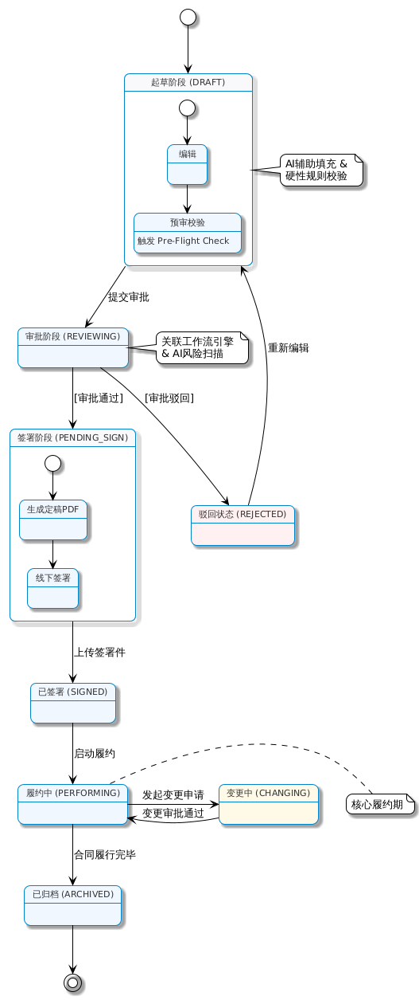

**合同变更管理**：

系统支持已生效合同的规范化变更管理，核心实体为 `ContractChange`。

> 详细用例流程参见SRS UC-07。

**变更发起权限**：
- 合同创建者（creatorId）可以发起变更
- 参与过该合同审批流程的用户也可以发起变更（系统支持两种权限来源）
- 只有已生效（status=2）的合同可以发起变更
- 同一合同同时只能有一个进行中的变更申请

**变更类型与审批规则**：

| 变更类型 | 是否需要审批 | 审批路径确定规则 |
| :--- | :--- | :--- |
| 金额增加 | 是（必须） | 按变更后总金额匹配审批流程 |
| 金额减少 | 是 | 按原审批流程执行 |
| 时间延长/提前 | 是 | 按原审批流程执行 |
| 技术方案变更 | 是（需技术评审） | 原审批流程+技术部门会签 |
| 附件补充 | 否 | 直接归档，无需审批 |
| 联系人变更 | 否 | 直接更新，记录日志 |

**重大变更判定**（需增加法务会签）：
- 金额增加超过原金额的20%
- 履约期限延长超过6个月
- 核心技术指标变更（如SLA指标）
- 付款方式重大调整

**变更历史追踪**：
- 系统为每个合同维护完整的变更历史
- 版本号递增（v1.0 → v2.0 → v3.0）
- 支持任意版本查看和对比

#### 4.3.2 审查规则引擎 (Pre-Flight Check)
在合同提交审批前进行的硬性规则检查，防止低级错误流入审批环节。系统根据合同类型（Type A/B/C）自动加载对应的检查规则集。

- **设计模式**: 策略模式 (Strategy Pattern)，支持运行时动态切换检查策略。

**检查模块架构**：

| 模块 | 功能描述 | 检查结果 |
| :--- | :--- | :--- |
| Module 1: 附件完整性检查 | 扫描上传文件包，验证强制附件是否齐全 | BLOCK / WARNING |
| Module 2: 数据逻辑校验 | 提取结构化数据实体，执行交叉验证 | ERROR / WARNING |
| Module 3: 语义风险扫描 | NLP/RAG检测禁止条款或高风险术语 | HIGH / MEDIUM / LOW |

**Type A 工程施工合同 - 强制附件**：

| 文档ID | 文档名称 | 级别 | 缺失动作 |
| :--- | :--- | :--- | :--- |
| DOC_A_001 | 安全生产协议 | CRITICAL | **阻断提交** |
| DOC_A_002 | 廉洁诚信承诺 | CRITICAL | **阻断提交** |
| DOC_A_003 | 农民工工资账户 | CRITICAL | **阻断提交** |
| DOC_A_004 | 履约保证金 | HIGH | 警告确认 |

**Type A 数值逻辑校验**：
- 安全生产费比例 ≥ 1.5%（法定要求）
- 质保金比例 = 3%（国企标准）
- 农民工工资账户号必须存在

**Type B 代维服务合同 - 强制附件**：

| 文档ID | 文档名称 | 级别 | 缺失动作 |
| :--- | :--- | :--- | :--- |
| DOC_B_001 | 技术规范书 | CRITICAL | **阻断提交** |
| DOC_B_002 | 考核细则 | CRITICAL | **阻断提交** |
| DOC_B_003 | 报价明细 | CRITICAL | **阻断提交** |
| DOC_B_004 | 安全生产责任书 | CRITICAL | **阻断提交** |

**Type B 数值逻辑校验**：
- 框架上限溢出检查（累计订单金额 ≤ 框架协议上限）
- SLA可用性指标 ≥ 99.5%
- 考核扣款机制必须定义

**Type C IT服务合同 - 强制附件**：

| 文档ID | 文档名称 | 级别 | 缺失动作 |
| :--- | :--- | :--- | :--- |
| DOC_C_001 | 数据安全承诺 | CRITICAL | **阻断提交** |
| DOC_C_002 | 开源软件承诺 | CRITICAL | **阻断提交** |
| DOC_C_003 | SLA服务等级 | HIGH | 警告确认 |
| DOC_C_004 | 报价清单 | CRITICAL | **阻断提交** |
| DOC_C_005 | 廉洁承诺 | CRITICAL | **阻断提交** |

**Type C 数值逻辑校验**：
- DICT项目必须使用"背靠背"付款条款
- UAT稳定运行期 ≥ 3个月
- 数据本地化条款必须存在

#### 4.3.3 审批流程引擎 (Workflow Engine)

自定义轻量级工作流引擎，支持动态流程配置。系统根据**合同类型**和**合同金额**自动匹配审批路径。

> 详见附录D：审批流程配置矩阵

**治理原则**：

| 原则 | 说明 |
| :--- | :--- |
| **单一法人实体规则** | 县级分公司**无签约权限**，所有审批必须升级到市级角色 |
| **Z岗级权限** | 财务阈值决定所需最高审批人（部门经理/副总/总经理） |
| **强制检查点** | 特定合同类型需要不可跳过的验证节点（如成本审计、财务应收检查） |
| **三重一大会议** | 金额 > 50万元人民币，在总经理审批前必须进行集体决策 |

**金额阶梯（Z岗级权限映射）**：

| 阶梯 | 金额范围 | 最终审批人 | 特殊条件 |
| :--- | :--- | :--- | :--- |
| Tier 1 | < 1万元 | 部门经理（市级） | 标准路径 |
| Tier 2 | 1万 - 5万元 | 副总经理（市级） | 需要升级审批 |
| Tier 3 | 5万 - 50万元 | 总经理（市级） | 高级审查 |
| Tier 4 | > 50万元 | 三重一大会议 + 总经理 | 集体决策 |

**合同子类型定义**：

| 类型代码 | 类别 | 子类型名称 | 典型把关人 |
| :--- | :--- | :--- | :--- |
| A1 | 工程施工 | 土建工程 | 项目经理、成本审计 |
| A2 | 工程施工 | 装修工程 | 项目经理、设计审查 |
| A3 | 工程施工 | 零星维修 | 设施协调员 |
| B1 | 代维服务 | 光缆代维 | 网络工程师、网络规划 |
| B2 | 代维服务 | 基站代维 | 射频工程师、站点获取 |
| B3 | 代维服务 | 家宽代维 | 家宽专家、客服主管 |
| B4 | 代维服务 | 应急保障 ⚡ | **快速通道** - 运营中心 |
| C1 | IT/DICT | 定制开发 | 技术负责人、安全审查、IT架构 |
| C2 | IT/DICT | 商用软件采购 | 采购专员、供应商管理 |
| C3 | IT/DICT | DICT集成 | 解决方案架构师、**财务应收检查** |

**特殊路由规则（强制性）**：

| 规则ID | 条件 | 强制节点 | 理由 |
| :--- | :--- | :--- | :--- |
| RULE-001 | 子类型 = C3（DICT集成） | 财务（应收检查） | 背靠背付款风险缓解 |
| RULE-002 | 子类型 = A1（土建工程）AND 金额 > 1万 | 成本审计 | 工程成本合规性 |
| RULE-003 | 子类型 = B4（应急保障） | **快速通道** - 跳过部门经理 | 应急响应优先级 |
| RULE-004 | 金额 > 50万 | 三重一大会议 | 集体决策要求 |

**审批路径示例（A1-Tier3: 土建工程 5-50万）**：

```
县级发起人 → 项目经理（市级） → 成本审计（市级） → 法务审查（市级） 
         → 部门经理（市级） → 副总经理（市级） → 总经理（市级） ✓
```

**角色注册表**（根据单一法人实体规则，以下均为市级角色）：

| 角色代码 | 角色名称 | 权限级别 | 所属部门 |
| :--- | :--- | :--- | :--- |
| INIT | 县级发起人 | 仅发起 | 县级分公司 |
| PM | 项目经理 | 技术审查 | 工程部 |
| CA | 成本审计 | 财务合规 | 财务部 |
| LR | 法务审查 | 合同合规 | 法务部 |
| DM | 部门经理 | 部门审批 | 各部门 |
| VP | 副总经理 | 执行审批 | 执行层 |
| T1M | 三重一大会议 | 集体决策 | 执行委员会 |
| GM | 总经理 | 最终权限 | 执行层 |

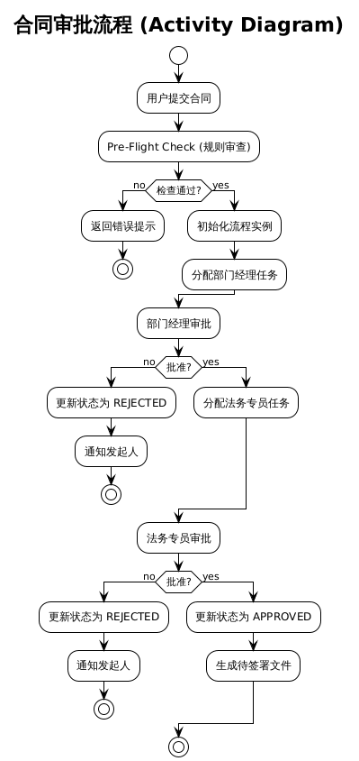


### 4.4 智能增强层设计

#### 4.4.1 知识库管理 (Knowledge Base)
- **数据源**: 法律法规、内部管理办法、历史合同模板。
- **处理流程**: 文本提取 -> 分块 (Chunking) -> 向量化 (Embedding) -> 存入 ChromaDB。
- **索引策略**: 混合索引（关键词 + 向量），提高检索准确率。

#### 4.4.2 AI 合同生成服务 (RAG)
利用 RAG 技术辅助用户快速起草合同。
- **输入**: 用户意图（如“起草一份基站建设合同，金额50万”）。
- **检索**: 从知识库中检索相关的模板片段和法律条款。
- **生成**: 组装 Prompt，调用 LLM 生成合同初稿。

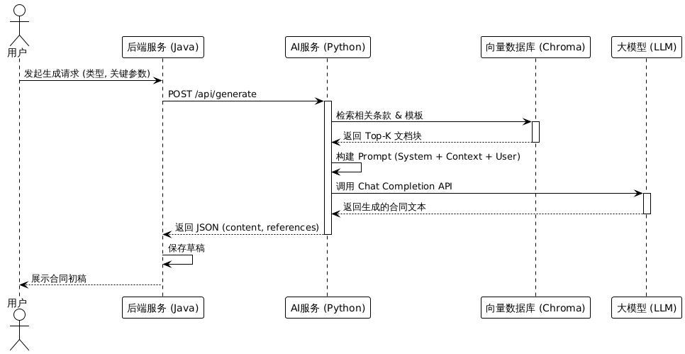


#### 4.4.3 AI 风险审查服务 (Risk Review)
- **触发时机**: 合同提交审批后异步触发。
- **处理逻辑**:
    1.  将合同文本分段。
    2.  针对每一段，结合审查规则（Prompt）调用 LLM 进行风险识别。
    3.  汇总风险点，计算风险等级（高/中/低）。
    4.  生成审查报告，存入数据库供审批人查看。

## 5. 子系统详细设计 (Subsystem Detailed Design)

本章将系统划分为四个核心功能子系统进行详细设计：合同管理子系统、审批流程子系统、智能服务子系统和系统管理子系统。这种划分方式更贴合业务领域，便于理解各模块的职责边界。

### 5.1 合同管理子系统 (Contract Management Subsystem)

#### 5.1.1 功能描述
负责合同全生命周期的管理，包括合同起草、模板管理、合同详情查看、附件管理及归档。该子系统是业务的核心，与其他子系统交互频繁。

#### 5.1.2 核心类设计 (Class Design)
- **ContractController**: 接收前端请求，处理合同相关的 CRUD 操作。
- **ContractService**: 封装合同业务逻辑，如状态流转、金额校验。
- **ContractTemplate**: 合同模板实体，用于快速起草。
- **Attachment**: 附件实体，关联合同文件。

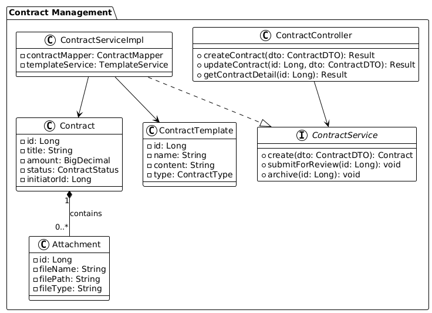


### 5.2 审批流程子系统 (Workflow Subsystem)

#### 5.2.1 功能描述
提供通用的审批流引擎能力，支持流程定义、流程实例启动、任务分配及审批操作。该子系统与合同状态紧密耦合，驱动合同状态的变更。

#### 5.2.2 核心类设计 (Class Design)
- **WorkflowEngine**: 流程引擎核心，负责解析流程定义和流转控制。
- **WfDefinition**: 流程定义实体，存储流程图结构（JSON）。
- **WfInstance**: 流程实例，代表一次具体的审批过程。
- **WfTask**: 待办任务，分配给具体审批人。

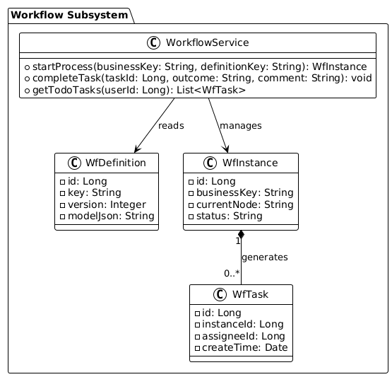


### 5.3 智能服务子系统 (Intelligent Service Subsystem)

#### 5.3.1 功能描述
封装所有 AI 相关能力，包括基于 RAG 的合同生成、智能风险审查及知识库管理。该子系统作为独立服务运行（Python），通过 REST API 为主系统提供支持。

#### 5.3.2 交互时序设计 (Sequence Design)
以“智能风险审查”为例，展示合同子系统与智能服务子系统的交互。

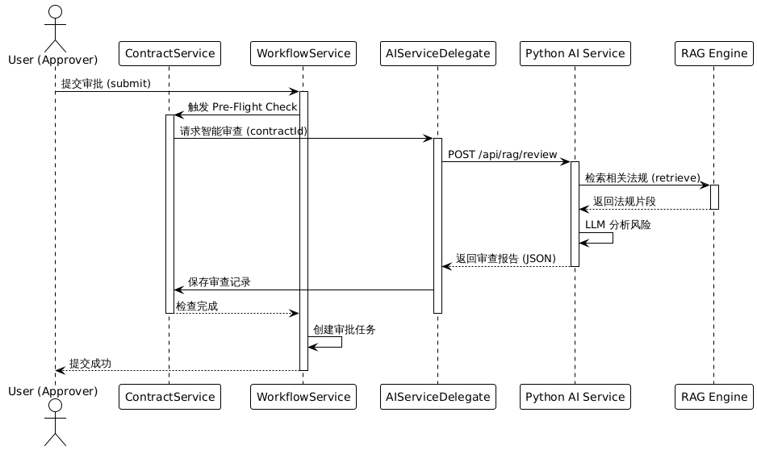


### 5.4 系统管理子系统 (System Management Subsystem)

#### 5.4.1 功能描述
负责系统的基础数据管理，包括组织架构（部门）、用户身份（账号）、权限控制（角色）及系统日志。

#### 5.4.2 核心类设计 (Class Design)
基于 RBAC 模型的设计。

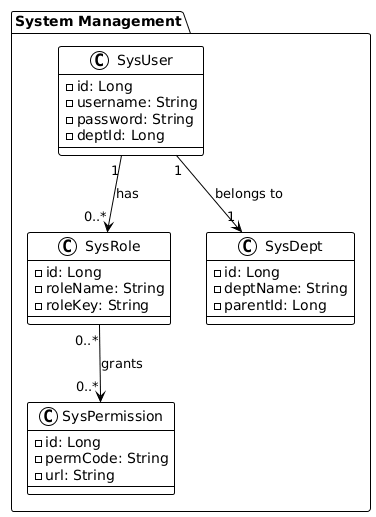


## 6. 数据库设计 (Database Design)

### 6.1 数据库设计原则
1.  **规范化**: 遵循第三范式 (3NF)，减少数据冗余。
2.  **命名规范**: 表名使用 `小写_下划线` 格式（如 `sys_user`），主键统一为 `id` (BIGINT)。
3.  **通用字段**: 所有业务表包含 `created_at`, `updated_at`, `is_deleted` (逻辑删除)。
4.  **索引优化**: 针对高频查询字段（如 `contract_code`, `status`, `user_id`）建立索引。

### 6.2 概念模型设计 (ER Diagram)
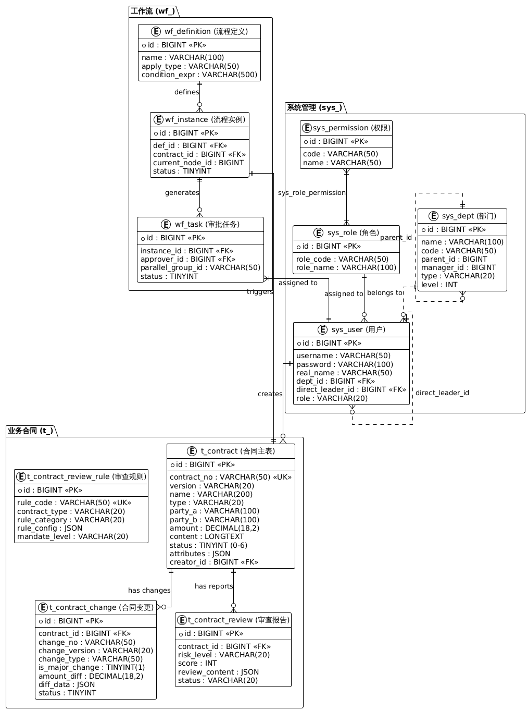


### 6.3 物理数据模型 (Data Schema)

#### 6.3.1 系统管理表

**用户表 (`sys_user`)**
| 字段名 | 类型 | 长度 | 说明 | 约束 |
| :--- | :--- | :--- | :--- | :--- |
| id | BIGINT | 20 | 主键ID | PK, Auto Inc |
| username | VARCHAR | 50 | 用户名 | Unique, Not Null |
| password | VARCHAR | 100 | 密码 (BCrypt) | Not Null |
| real_name | VARCHAR | 50 | 真实姓名 | |
| role | VARCHAR | 20 | 系统基础角色：ADMIN/STAFF/BOSS，用于系统权限控制 | |
| primary_role | VARCHAR | 50 | 业务审批角色编码，关联sys_role.role_code，用于工作流审批匹配 | FK -> sys_role.role_code |
| z_level | VARCHAR | 10 | Z岗级（Z8-Z15） | |
| dept_id | BIGINT | 20 | 部门ID | FK -> sys_dept.id |
| direct_leader_id | BIGINT | 20 | 直接上级用户ID | FK -> sys_user.id |
| mobile | VARCHAR | 20 | 手机号 | |
| email | VARCHAR | 100 | 邮箱 | |
| is_active | TINYINT | 1 | 状态 (1:启用, 0:禁用) | Default 1 |
| created_at | DATETIME | - | 创建时间 | |
| updated_at | DATETIME | - | 更新时间 | |

**说明**：系统采用双重角色架构，`role`字段存储系统基础角色（ADMIN/STAFF/BOSS），用于系统级权限控制；`primary_role`字段存储业务审批角色编码（如PROJECT_MANAGER、LEGAL_REVIEWER），关联`sys_role`表，用于工作流引擎的审批人匹配。

**部门表 (`sys_dept`)**
| 字段名 | 类型 | 长度 | 说明 | 约束 |
| :--- | :--- | :--- | :--- | :--- |
| id | BIGINT | 20 | 主键ID | PK |
| parent_id | BIGINT | 20 | 父部门ID | 0为根节点 |
| dept_name | VARCHAR | 50 | 部门名称 | Not Null |
| order_num | INT | 11 | 显示顺序 | |
| leader | VARCHAR | 50 | 负责人 | |

#### 6.3.2 合同业务表

**合同主表 (`contract`)**
| 字段名 | 类型 | 长度 | 说明 | 约束 |
| :--- | :--- | :--- | :--- | :--- |
| id | BIGINT | 20 | 主键ID | PK |
| contract_code | VARCHAR | 64 | 合同编号 | Unique |
| title | VARCHAR | 200 | 合同标题 | Not Null |
| type | VARCHAR | 20 | 类型 (Type A/B/C) | |
| amount | DECIMAL | 18,2 | 合同金额 | |
| status | VARCHAR | 20 | 状态 (DRAFT, REVIEWING...) | |
| initiator_id | BIGINT | 20 | 发起人ID | FK -> sys_user.id |
| content | LONGTEXT | - | 合同正文 (HTML/Markdown) | |
| attachment_ids | VARCHAR | 500 | 附件ID列表 (逗号分隔) | |

**合同审查记录表 (`contract_review`)**
| 字段名 | 类型 | 长度 | 说明 | 约束 |
| :--- | :--- | :--- | :--- | :--- |
| id | BIGINT | 20 | 主键ID | PK |
| contract_id | BIGINT | 20 | 合同ID | FK -> contract.id |
| risk_level | VARCHAR | 20 | 风险等级 (HIGH/MEDIUM/LOW) | |
| score | INT | 11 | 合规评分 (0-100) | |
| ai_report | JSON | - | AI审查报告详情 | |
| manual_comments | TEXT | - | 人工审核意见 | |

**合同变更表 (`contract_change`)**
| 字段名 | 类型 | 长度 | 说明 | 约束 |
| :--- | :--- | :--- | :--- | :--- |
| id | BIGINT | 20 | 主键ID | PK |
| contract_id | BIGINT | 20 | 原合同ID | FK -> contract.id |
| version | VARCHAR | 10 | 变更版本号 (v2.0, v3.0) | |
| change_type | VARCHAR | 30 | 变更类型 | |
| change_reason | VARCHAR | 50 | 变更原因 | |
| change_desc | TEXT | - | 变更说明 | |
| is_major | TINYINT | 1 | 是否重大变更 | Default 0 |
| amount_diff | DECIMAL | 18,2 | 金额差额 | |
| before_content | JSON | - | 变更前内容 | |
| after_content | JSON | - | 变更后内容 | |
| status | VARCHAR | 20 | 状态 (DRAFT, REVIEWING, APPROVED, REJECTED) | |
| wf_instance_id | BIGINT | 20 | 审批流程实例ID | FK -> wf_instance.id |
| initiator_id | BIGINT | 20 | 发起人ID | FK -> sys_user.id |

**变更对比记录表 (`change_comparison`)**
| 字段名 | 类型 | 长度 | 说明 | 约束 |
| :--- | :--- | :--- | :--- | :--- |
| id | BIGINT | 20 | 主键ID | PK |
| change_id | BIGINT | 20 | 变更ID | FK -> contract_change.id |
| field_name | VARCHAR | 50 | 变更字段名 | |
| before_value | TEXT | - | 变更前值 | |
| after_value | TEXT | - | 变更后值 | |
| change_rate | VARCHAR | 20 | 变更幅度 (+20%, 延长6个月) | |

#### 6.3.3 工作流引擎表

**流程定义表 (`wf_definition`)**
| 字段名 | 类型 | 长度 | 说明 | 约束 |
| :--- | :--- | :--- | :--- | :--- |
| id | BIGINT | 20 | 主键ID | PK |
| name | VARCHAR | 100 | 流程名称 | |
| version | INT | 11 | 版本号 | |
| json_content | JSON | - | 流程图结构定义 | Not Null |
| status | TINYINT | 1 | 状态 (1:激活, 0:挂起) | |

**流程实例表 (`wf_instance`)**
| 字段名 | 类型 | 长度 | 说明 | 约束 |
| :--- | :--- | :--- | :--- | :--- |
| id | BIGINT | 20 | 主键ID | PK |
| definition_id | BIGINT | 20 | 流程定义ID | FK |
| business_id | BIGINT | 20 | 业务ID (合同ID) | |
| current_node_id | VARCHAR | 50 | 当前节点ID | |
| status | VARCHAR | 20 | 状态 (RUNNING, FINISHED...) | |

**流程任务表 (`wf_task`)**
| 字段名 | 类型 | 长度 | 说明 | 约束 |
| :--- | :--- | :--- | :--- | :--- |
| id | BIGINT | 20 | 主键ID | PK |
| instance_id | BIGINT | 20 | 流程实例ID | FK |
| node_id | VARCHAR | 50 | 节点ID | |
| assignee_id | BIGINT | 20 | 处理人ID | FK -> sys_user.id |
| outcome | VARCHAR | 20 | 处理结果 (PASS, REJECT) | |
| comment | VARCHAR | 500 | 审批意见 | |

#### 6.3.4 知识库与AI表

**知识库文档表 (`knowledge_document`)**
| 字段名 | 类型 | 长度 | 说明 | 约束 |
| :--- | :--- | :--- | :--- | :--- |
| id | BIGINT | 20 | 主键ID | PK |
| title | VARCHAR | 200 | 文档标题 | |
| category | VARCHAR | 50 | 分类 (LAW, TEMPLATE...) | |
| file_path | VARCHAR | 255 | 文件存储路径 | |
| vector_ids | JSON | - | 关联的向量ID列表 | 对应 ChromaDB |
| status | TINYINT | 1 | 状态 (0:处理中, 1:已索引) | |

## 7. 接口设计 (Interface Design)

### 7.1 接口设计规范 (RESTful API)

系统接口遵循 RESTful 风格，使用 HTTP 方法表达操作意图，使用 JSON 作为数据交换格式。

-   **URL 规范**: `/api/{version}/{resource}/{action}`，例如 `/api/v1/contracts/create`。
-   **HTTP 方法**:
    -   `GET`: 获取资源
    -   `POST`: 创建资源或执行复杂操作
    -   `PUT`: 全量更新资源
    -   `DELETE`: 删除资源
-   **统一响应格式**:
    ```json
    {
      "code": 200,
      "message": "操作成功",
      "data": { ... }
    }
    ```
-   **状态码定义**:
    -   `200`: 成功
    -   `401`: 未授权 (Token 无效/过期)
    -   `403`: 禁止访问 (权限不足)
    -   `404`: 资源不存在
    -   `500`: 服务器内部错误

### 7.2 内部子系统接口

#### 7.2.1 后端与AI服务交互接口

后端服务 (Java) 作为客户端，调用 AI 服务 (Python) 提供的能力。

**1. AI对话接口（Ask模式）**
-   **URL**: `POST /ai/chat/ask`
-   **调用方**: 后端服务 -> 前端 -> AI服务
-   **说明**: Ask模式用于问答，AI仅提供咨询建议，不修改合同内容
-   **请求体**:
    ```json
    {
      "sessionId": "session_xxx",
      "message": "合同安全费比例应该是多少？",
      "mode": "ASK"
    }
    ```

**2. AI对话接口（Agent模式）**
-   **URL**: `POST /ai/chat/agent`
-   **调用方**: 后端服务 -> 前端 -> AI服务
-   **说明**: Agent模式用于执行修改操作，AI可以直接修改合同内容
-   **请求体**:
    ```json
    {
      "sessionId": "session_xxx",
      "message": "将安全费比例改为1.5%",
      "mode": "AGENT",
      "contractId": 123
    }
    ```

**3. 合同条款生成接口**
-   **URL**: `POST /api/ai/generate`
-   **调用方**: 后端服务 -> AI 服务
-   **请求体**:
    ```json
    {
      "contract_type": "Type A",
      "requirements": "基站建设，金额50万，工期3个月"
    }
    ```
-   **响应体**:
    ```json
    {
      "success": true,
      "content": "根据您的需求，已生成合同草稿...",
      "rag_used": true
    }
    ```

**4. 风险审查接口**
-   **URL**: `POST /api/ai/check`
-   **调用方**: 后端服务 -> AI 服务
-   **请求体**:
    ```json
    {
      "contract_id": 2023001,
      "content": "合同正文内容..."
    }
    ```
-   **响应体**:
    ```json
    {
      "success": true,
      "risk_level": "MEDIUM",
      "score": 85,
      "issues": [
        { "severity": "HIGH", "description": "缺少安全生产协议附件", "suggestion": "请补充附件" }
      ]
    }
    ```

**5. AI服务内部接口（后端调用）**
-   **URL**: `POST /api/chat`（AI服务内部接口）
-   **调用方**: 后端服务直接调用AI服务的底层接口
-   **说明**: 后端通过WebClient调用AI服务的/api/chat接口，AI服务返回对话回复

### 7.3 前后端交互接口

#### 7.3.1 合同管理模块

| 接口名称 | URL | 方法 | 说明 |
| :--- | :--- | :--- | :--- |
| 分页查询合同 | `/api/v1/contracts` | GET | 支持按状态、类型、时间筛选 |
| 获取合同详情 | `/api/v1/contracts/{id}` | GET | 返回合同基本信息及正文 |
| 创建合同草稿 | `/api/v1/contracts` | POST | 保存合同基本信息 |
| 更新合同内容 | `/api/v1/contracts/{id}` | PUT | 更新正文或附件 |
| 提交审批 | `/api/v1/contracts/{id}/submit` | POST | 触发 Pre-Flight Check 及工作流 |
| 删除合同 | `/api/v1/contracts/{id}` | DELETE | 仅限草稿状态 |

#### 7.3.2 工作流模块

| 接口名称 | URL | 方法 | 说明 |
| :--- | :--- | :--- | :--- |
| 获取待办任务 | `/api/v1/workflow/tasks/todo` | GET | 查询当前用户的待办 |
| 获取已办任务 | `/api/v1/workflow/tasks/done` | GET | 查询当前用户的已办 |
| 审批任务 | `/api/v1/workflow/tasks/{taskId}/complete` | POST | 提交审批结果 (PASS/REJECT) |
| 获取审批历史 | `/api/v1/workflow/instance/{instanceId}/history` | GET | 获取流程流转记录 |

#### 7.3.3 知识库模块

| 接口名称 | URL | 方法 | 说明 |
| :--- | :--- | :--- | :--- |
| 上传文档 | `/api/v1/knowledge/upload` | POST | 支持 PDF/Word/Markdown |
| 查询文档列表 | `/api/v1/knowledge/list` | GET | 分页查询 |
| 重建索引 | `/api/v1/knowledge/reindex` | POST | 触发向量库重建 |


## 8. 安全设计 (Security Design)

### 8.1 身份认证与会话管理 (Authentication & Session)

系统采用 **JWT (JSON Web Token)** 进行无状态身份认证，结合 Spring Security 框架实现。

-   **认证流程**:
    1.  用户提交用户名/密码。
    2.  后端校验通过后，生成包含用户ID、角色、过期时间的 JWT。
    3.  前端将 JWT 存储在 LocalStorage/SessionStorage。
    4.  后续请求在 HTTP Header `Authorization: Bearer <token>` 中携带。
-   **Token 策略**:
    -   **Access Token**: 有效期短（如 2 小时），用于访问资源。
    -   **Refresh Token**: 有效期长（如 7 天），用于刷新 Access Token，减少频繁登录。
-   **密码存储**: 使用 BCrypt 强哈希算法加盐存储，禁止明文存储。

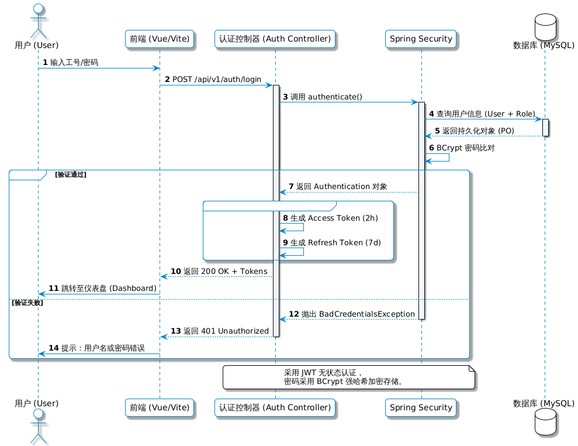


### 8.2 访问控制策略 (Access Control)

采用 **RBAC (Role-Based Access Control)** 模型，实现细粒度的权限控制。

-   **URL 级控制**: 通过 Spring Security 的过滤器链配置，限制特定 URL 模式仅允许特定角色访问。
    -   `/api/admin/**` -> 仅限 `ADMIN` 角色
    -   `/api/contract/approve` -> 仅限 `MANAGER` 或 `LEADER` 角色
-   **方法级控制**: 使用 `@PreAuthorize` 注解控制 Service 方法的调用权限。
    ```java
    @PreAuthorize("hasAuthority('contract:audit')")
    public void auditContract(ApproveDTO dto) { ... }
    ```
-   **数据级控制**: 通过 MyBatis Plus 的拦截器实现数据权限过滤（Data Scope）。
    -   普通员工：只能查看自己创建的合同。
    -   部门经理：可以查看本部门及下属部门的合同。

### 8.3 数据安全与隐私保护 (Data Security)

鉴于电信行业数据的敏感性，采取多重措施保障数据安全。

-   **传输加密**: 全站强制启用 HTTPS (TLS 1.2+)，防止中间人攻击和数据窃听。
-   **敏感数据脱敏**:
    -   在日志打印和前端展示时，对手机号、身份证号等个人隐私信息进行掩码处理（如 `138****1234`）。
    -   使用 Jackson 序列化器自动处理脱敏逻辑。
-   **SQL 注入防御**:
    -   全面使用 MyBatis 的 `#{}` 预编译参数，严禁使用 `${}` 拼接 SQL。
    -   配置 Web 防火墙 (WAF) 拦截恶意 SQL 特征请求。
-   **文件安全**:
    -   上传文件进行类型校验（白名单机制）和病毒扫描。
    -   合同附件存储在非 Web 根目录下，通过流式接口下载，防止直接链接访问。
-   **审计日志**:
    -   记录所有关键操作（登录、审批、导出、删除）的日志，包含操作人、IP、时间、操作内容。
    -   审计日志单独存储，禁止篡改。

## 9. 非功能性设计 (Non-functional Design)

### 9.1 性能设计 (Performance)

-   **响应时间指标**:
    -   普通页面加载时间 < 1s。
    -   简单业务操作（如查询、保存草稿）响应时间 < 500ms。
    -   复杂业务操作（如提交审批、生成报表）响应时间 < 3s。
    -   AI 合同生成响应时间 < 30s（流式输出首字响应 < 3s）。
-   **并发能力**:
    -   支持 500+ 在线用户。
    -   支持 50+ 并发审批操作。
-   **优化策略**:
    -   **前端**: 启用 Gzip 压缩，静态资源 CDN 加速，路由懒加载。
    -   **后端**: 数据库读写分离，热点数据（如数据字典、组织架构）使用 Redis 缓存。
    -   **AI服务**: 使用异步队列（Celery/RabbitMQ）处理耗时任务，避免阻塞主线程。

### 9.2 可靠性与可用性 (Reliability & Availability)

-   **可用性目标**: 系统可用性达到 99.9%（全年停机时间 < 8.76小时）。
-   **容错机制**:
    -   **服务降级**: 当 AI 服务不可用时，系统自动切换为人工起草模式，不影响核心审批流程。
    -   **断点续传**: 大文件上传支持断点续传，防止网络波动导致上传失败。
    -   **数据备份**: 数据库每日全量备份，每小时增量备份，保留最近 30 天数据。
-   **监控告警**:
    -   集成 Prometheus + Grafana 监控系统资源（CPU/内存/磁盘）及应用指标（QPS/错误率）。
    -   关键服务宕机或错误率飙升时，通过邮件/短信发送告警。

### 9.3 可扩展性 (Scalability)

-   **水平扩展**: 后端服务和 AI 服务均为无状态设计，支持通过增加节点（Pod）实现线性扩展。
-   **模块化设计**: 业务模块（合同、工作流、知识库）之间低耦合，未来可拆分为微服务独立部署。
-   **配置化**: 审批流程、审查规则、数据字典等均支持后台配置，无需修改代码即可适应业务变化。

## 10. 设计理由说明 (Design Rationale)

> 本章依据 IEEE Std 1016-2009 第4.8节要求编写，记录关键设计决策的理由。

### 10.1 架构决策理由

| 设计决策 | 考虑的替代方案 | 选择理由 |
| :--- | :--- | :--- |
| **前后端分离架构** | 服务端渲染(SSR)、单体应用 | 降低耦合，支持独立部署，前端可使用现代框架提升用户体验 |
| **微服务化AI服务** | 将AI功能嵌入后端 | Python生态更适合AI/ML开发，独立服务可单独扩展和更新模型 |
| **自研轻量工作流引擎** | 使用Activiti/Flowable | 电信审批场景相对固定，轻量实现更易维护，避免重型引擎带来的复杂性 |
| **ChromaDB作为向量库** | Pinecone, Milvus, Faiss | 开源免费，支持本地部署，API简洁，满足知识库规模需求 |

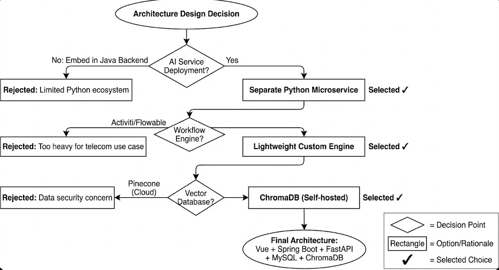

### 10.2 设计模式应用理由

| 应用的设计模式 | 应用位置 | 选择理由 |
| :--- | :--- | :--- |
| **策略模式** | 审批策略组件、Pre-Flight Check规则引擎 | 支持运行时动态切换算法，便于扩展新的审批策略或审查规则 |
| **工厂模式** | 合同类型创建、流程节点创建 | 统一创建逻辑，便于根据类型参数动态生成不同对象 |
| **观察者模式** | 审批状态变更通知、合同状态同步 | 解耦状态变更与业务处理逻辑，支持多订阅者响应事件 |
| **模板方法模式** | 不同合同类型的风险审查流程 | 固定审查骨架流程，允许各类型合同定制具体检查逻辑 |

### 10.3 技术选型理由

| 技术选型 | 考虑的替代方案 | 选择理由 |
| :--- | :--- | :--- |
| **Spring Boot 3.x** | Quarkus, Micronaut | 生态成熟，团队熟悉度高，社区支持完善 |
| **Vue 3 + TypeScript** | React, Angular | 轻量灵活，Composition API适合复杂业务逻辑组织 |
| **FastAPI** | Flask, Django REST | 原生异步支持，自动生成OpenAPI文档，性能优异 |
| **MySQL 8.0** | PostgreSQL, TiDB | 电信行业普遍采用，运维经验丰富，性能稳定 |

### 10.4 约束与权衡

| 约束条件 | 权衡决策 | 接受的后果 |
| :--- | :--- | :--- |
| **12周开发周期** | 优先实现核心审批流程，AI功能采用RAG而非微调 | 模型精度略低于专门训练的模型，但开发速度显著提升 |
| **团队Python经验有限** | AI服务接口保持简洁，复杂逻辑由后端Java处理 | 需要跨语言调试，增加少量通信开销 |
| **数据安全合规要求** | 全链路HTTPS、数据脱敏、审计日志 | 开发复杂度增加，但满足电信行业合规要求 |

---

## 11. 附录A (Appendix A)

### 11.1 第三方库清单

| 组件名称 | 版本 | 许可证 | 用途 |
| :--- | :--- | :--- | :--- |
| Spring Boot | 3.5.6 | Apache 2.0 | 后端核心框架 |
| MyBatis Plus | 3.5.x | Apache 2.0 | ORM 框架 |
| Vue.js | 3.x | MIT | 前端核心框架 |
| Element Plus | 2.x | MIT | UI 组件库 |
| FastAPI | 0.104+ | MIT | AI 服务框架 |
| LangChain | 0.1.x | MIT | LLM 应用开发框架 |
| ChromaDB | 0.4.x | Apache 2.0 | 向量数据库 |

### 11.2 修订历史

| 版本 | 日期 | 修改人 | 说明 |
| :--- | :--- | :--- | :--- |
| v1.0 | 2025-12-22 | 架构组 | 初始版本发布 |
| v1.1 | 2025-12-31 | 架构组 | 按照IEEE 1016-2009标准重构文档结构；新增设计涉众与关注点章节；更新所有章节编号 |

---

## 12. 附录B：图片需求清单 (Required Diagrams)

> 本附录列出SDD文档中引用的所有图表及其位置说明。

### 12.1 现有图片清单

当前`SDD图片`文件夹已包含以下**16张**图片：

| 图片编号 | 文件名 | 引用位置 | 图片类型 |
| :--- | :--- | :--- | :--- |
| 1 | 2.1-系统逻辑架构.png | 3.2 系统逻辑架构 | 架构图 |
| 2 | 2.1-系统上下文图.png | 2.3 关注点与IEEE设计视图映射 | 上下文图 |
| 3 | 3.1-系统模块划分图.png | 4.1 模块划分概述 | 模块图 |
| 4 | 3.1-物理部署架构图.png | 3.4 物理部署架构 | 部署图 |
| 5 | 3.2-合同状态机图.png | 4.3.1 合同全生命周期管理 | 状态图 |
| 6 | 3.3-审批流程活动图.png | 4.3.3 审批流程引擎 | 活动图 |
| 7 | 3.4-AI合同生成时序图.png | 4.4.2 AI合同生成服务 | 时序图 |
| 8 | 4.1-合同管理子系统类图.png | 5.1.2 核心类设计 | 类图 |
| 9 | 4.1-组织树审批策略图.png | 4.3.3 审批流程引擎 | 概念图 |
| 10 | 4.2-审批流程子系统类图.png | 5.2.2 核心类设计 | 类图 |
| 11 | 4.3-智能审查时序图.png | 5.3.2 交互时序设计 | 时序图 |
| 12 | 4.4-系统管理子系统类图.png | 5.4.2 核心类设计 | 类图 |
| 13 | 5.1-数据库ER图.png | 6.2 概念模型设计 | ER图 |
| 14 | 6.1-接口调用时序图.png | 7.3.3 知识库模块 | 时序图 |
| 15 | 7.1-认证流程图.png | 8.1 身份认证与会话管理 | 流程图 |
| 16 | 11.1-设计决策流程图.png | 11.1 架构决策理由 | 决策图 |

### 12.2 图片完整性说明

> ✅ **所有设计图片已齐全**。本文档引用的16张设计图片均已存放于`SDD图片`文件夹中，涵盖：
> - 架构视图（系统逻辑架构、上下文图、物理部署图）
> - 行为视图（状态机图、活动图、时序图）
> - 结构视图（类图、模块图、ER图）
> - 决策视图（设计决策流程图、组织树审批策略图）

---

## 13. 附录C：组织树设计详情 (Organization Tree Design)

> 本附录详述中国移动省级公司组织树的完整设计方案。

### C.1 设计原则

| 原则 | 说明 |
| :--- | :--- |
| **单树结构** | 以省公司为根节点，所有市级、县级、部门构成一棵完整的组织树 |
| **三级法人四级层级** | 法人实体为省-市-县三级，但组织树因职能部门存在呈现四级层级（省级职能部门与市级分公司平级，市级职能部门与县级分公司平级） |
| **部门与职位分离** | 组织树只存储部门层级，职位/角色通过用户表关联 |
| **标准化模板** | 提供标准组织架构模板，管理员可根据实际情况调整 |
| **县市平级** | 市级职能部门与县级分公司是兄弟节点，共同向市级分公司汇报 |
| **名称统一** | 部门命名标准化（如"网络部"），便于县→市自动匹配 |

**关键约束**：
- **BR-100**：组织树必须有且仅有一个根节点（省公司）
- **BR-101**：县级分公司必须隶属于市级分公司
- **BR-102**：同一层级的部门名称不能重复
- **BR-103**：禁止循环引用（部门不能移动到自己的子节点下）
- **BR-104**：组织架构为省-市-县三级法人架构，组织树为四级层级结构（level字段：1=省公司，2=省级职能部门/市级分公司，3=市级职能部门/县级分公司，4=县级职能部门）

### C.2 四级层级结构

```
第1级：省公司（根节点）
  ├─ 第2级：省级职能部门（6个核心部门）
  ├─ 第2级：市级分公司（N个）
       ├─ 第3级：市级职能部门（7个标准部门）
       ├─ 第3级：县级分公司（M个）
            └─ 第4级：县级职能部门（4个精简部门）
```

**完整树形结构示意**：

```
中国移动XX省公司（ROOT, id=1, level=1）
│
├── 省公司网络部（id=10, level=2）
├── 省公司市场部（id=11, level=2）
├── 省公司政企部（id=12, level=2）
├── 省公司法务部（id=13, level=2）
├── 省公司财务部（id=14, level=2）
├── 省公司综合部（id=15, level=2）
│
├── A市分公司（id=100, level=2）
│   ├── A市网络部（id=101, level=3）
│   ├── A市市场经营部（id=102, level=3）
│   ├── A市政企客户部（id=103, level=3）
│   ├── A市法务部（id=104, level=3）
│   ├── A市财务部（id=105, level=3）
│   ├── A市综合部（id=106, level=3）
│   ├── A市采购部（id=107, level=3）
│   ├── C县分公司（id=150, level=3）← 与市级部门平级
│   │   ├── C县综合部（id=151, level=4）
│   │   ├── C县市场部（id=152, level=4）
│   │   ├── C县网络部（id=153, level=4）
│   │   └── C县政企部（id=154, level=4）
│   └── D县分公司（id=160, level=3）
│       └── ... （结构同C县）
│
└── B市分公司（id=200, level=2）
    └── ... （结构同A市）
```

### C.3 部门设置详情

**省级部门（6个核心部门）**：

| 部门代码 | 部门名称 | 主要职责 | 对应审批角色 |
| :--- | :--- | :--- | :--- |
| PROV-NET | 省公司网络部 | 全省网络规划、重大工程审查 | 省级技术审查 |
| PROV-MKT | 省公司市场部 | 全省营销策略、品牌管理 | 省级市场审查 |
| PROV-GOV | 省公司政企部 | 重大政企项目（>200万） | 省级政企审查 |
| PROV-LEGAL | 省公司法务部 | 重大合同法务审查、合规管理 | 省级法务审查 |
| PROV-FIN | 省公司财务部 | 全省预算管理、超大额审计 | 省级财务审查 |
| PROV-ADMIN | 省公司综合部 | 省级人事、行政、后勤 | 省级管理支撑 |

**市级部门（7个标准部门）**：

| 部门代码 | 部门名称 | 主要职责 | 对应审批角色 |
| :--- | :--- | :--- | :--- |
| CITY-X-NET | X市网络部 | 网络运维、基站建设、代维管理 | 射频工程师/网络工程师/网络规划 |
| CITY-X-MKT | X市市场经营部 | B2C业务、渠道管理、终端销售 | 市场专员 |
| CITY-X-GOV | X市政企客户部 | B2B业务、DICT项目、政企客户 | 解决方案架构师/DICT项目经理 |
| CITY-X-LEGAL | X市法务部 | 合同法务审查、法律风险控制 | 法务审查(LR) |
| CITY-X-FIN | X市财务部 | 成本审计、财务审核、应收检查 | 成本审计(CA)/财务应收检查(FRC) |
| CITY-X-ADMIN | X市综合部 | 人事、行政、印章管理、后勤 | 行政支撑 |
| CITY-X-PROC | X市采购部 | 供应商管理、采购审查 | 采购专员(PS)/供应商管理(VM) |

**县级部门（4个精简部门）**：

| 部门代码 | 部门名称 | 主要职责 | 说明 |
| :--- | :--- | :--- | :--- |
| COUNTY-X-ADMIN | X县综合部 | 人事、行政、财务报账、后勤 | 多职能合并 |
| COUNTY-X-MKT | X县市场部 | 营销、渠道拓展、业务发展 | 发起B2C类合同 |
| COUNTY-X-NET | X县网络部 | 网络维护、宽带装维、故障处理 | 发起A/B类合同 |
| COUNTY-X-GOV | X县政企部 | 政企客户拓展、项目实施 | 发起C类合同 |

### C.4 数据库表结构

**组织架构表（sys_dept）**：

```sql
CREATE TABLE `sys_dept` (
  `id` bigint NOT NULL AUTO_INCREMENT COMMENT '主键ID',
  `parent_id` bigint DEFAULT '0' COMMENT '父部门ID（0表示根节点）',
  `name` varchar(100) NOT NULL COMMENT '部门名称',
  `code` varchar(50) DEFAULT NULL COMMENT '部门代码',
  `type` varchar(20) DEFAULT 'DEPT' COMMENT '类型: PROVINCE/CITY/COUNTY/DEPT',
  `level` int DEFAULT 1 COMMENT '树层级（1-4）',
  `manager_id` bigint DEFAULT NULL COMMENT '部门负责人用户ID',
  `sort_order` int DEFAULT 0 COMMENT '排序序号',
  `is_deleted` tinyint DEFAULT 0 COMMENT '是否删除（软删除）',
  `created_at` datetime DEFAULT CURRENT_TIMESTAMP,
  `updated_at` datetime DEFAULT CURRENT_TIMESTAMP ON UPDATE CURRENT_TIMESTAMP,
  PRIMARY KEY (`id`),
  KEY `idx_parent_id` (`parent_id`),
  KEY `idx_type` (`type`),
  KEY `idx_code` (`code`)
) ENGINE=InnoDB DEFAULT CHARSET=utf8mb4 COMMENT='组织架构表';
```

**角色定义表（sys_role）**：

```sql
CREATE TABLE `sys_role` (
  `id` bigint NOT NULL AUTO_INCREMENT,
  `role_code` varchar(50) NOT NULL COMMENT '角色编码',
  `role_name` varchar(100) NOT NULL COMMENT '角色名称',
  `role_category` varchar(50) DEFAULT NULL COMMENT '角色类别',
  `dept_type_required` varchar(50) DEFAULT NULL COMMENT '要求的部门类型',
  `z_level_min` varchar(10) DEFAULT NULL COMMENT '最低Z岗级要求',
  `description` varchar(200) DEFAULT NULL COMMENT '角色说明',
  `created_at` datetime DEFAULT CURRENT_TIMESTAMP,
  PRIMARY KEY (`id`),
  UNIQUE KEY `uk_role_code` (`role_code`)
) ENGINE=InnoDB DEFAULT CHARSET=utf8mb4 COMMENT='角色定义表';
```

### C.5 组织架构初始化SQL

```sql
-- 第1层：省公司（根节点）
INSERT INTO sys_dept (id, parent_id, name, code, type, level) VALUES 
(1, 0, '中国移动XX省公司', 'PROVINCE', 'PROVINCE', 1);

-- 第2层：省级职能部门
INSERT INTO sys_dept (id, parent_id, name, code, type, level) VALUES 
(10, 1, '省公司网络部', 'PROV-NET', 'DEPT', 2),
(11, 1, '省公司市场部', 'PROV-MKT', 'DEPT', 2),
(12, 1, '省公司政企部', 'PROV-GOV', 'DEPT', 2),
(13, 1, '省公司法务部', 'PROV-LEGAL', 'DEPT', 2),
(14, 1, '省公司财务部', 'PROV-FIN', 'DEPT', 2),
(15, 1, '省公司综合部', 'PROV-ADMIN', 'DEPT', 2);

-- 第2层：市级分公司
INSERT INTO sys_dept (id, parent_id, name, code, type, level) VALUES 
(100, 1, 'A市分公司', 'CITY-A', 'CITY', 2),
(200, 1, 'B市分公司', 'CITY-B', 'CITY', 2);

-- 第3层：A市职能部门
INSERT INTO sys_dept (id, parent_id, name, code, type, level) VALUES 
(101, 100, 'A市网络部', 'CITY-A-NET', 'DEPT', 3),
(102, 100, 'A市市场经营部', 'CITY-A-MKT', 'DEPT', 3),
(103, 100, 'A市政企客户部', 'CITY-A-GOV', 'DEPT', 3),
(104, 100, 'A市法务部', 'CITY-A-LEGAL', 'DEPT', 3),
(105, 100, 'A市财务部', 'CITY-A-FIN', 'DEPT', 3),
(106, 100, 'A市综合部', 'CITY-A-ADMIN', 'DEPT', 3),
(107, 100, 'A市采购部', 'CITY-A-PROC', 'DEPT', 3);

-- 第3层：县级分公司
INSERT INTO sys_dept (id, parent_id, name, code, type, level) VALUES 
(150, 100, 'C县分公司', 'COUNTY-C', 'COUNTY', 3),
(160, 100, 'D县分公司', 'COUNTY-D', 'COUNTY', 3);

-- 第4层：C县职能部门
INSERT INTO sys_dept (id, parent_id, name, code, type, level) VALUES 
(151, 150, 'C县综合部', 'COUNTY-C-ADMIN', 'DEPT', 4),
(152, 150, 'C县市场部', 'COUNTY-C-MKT', 'DEPT', 4),
(153, 150, 'C县网络部', 'COUNTY-C-NET', 'DEPT', 4),
(154, 150, 'C县政企部', 'COUNTY-C-GOV', 'DEPT', 4);
```

### C.6 县→市自动匹配逻辑

**场景**：C县网络部发起合同 → 需要A市网络部审批

**匹配规则**：
1. 找到发起人所在的县级分公司
2. 向上找到县级分公司的上级市级分公司
3. 在市级分公司下查找**名称匹配**的部门（如"网络部"）

**SQL查询示例**：

```sql
-- 查询：C县网络部（dept_id=153）对应的市级网络部

-- Step 1: 找到县级分公司
SELECT parent_id AS county_company_id FROM sys_dept WHERE id = 153;
-- 结果：150（C县分公司）

-- Step 2: 找到市级分公司
SELECT parent_id AS city_company_id FROM sys_dept WHERE id = 150;
-- 结果：100（A市分公司）

-- Step 3: 在市级分公司下找同名部门
SELECT id, name FROM sys_dept
WHERE parent_id = 100 AND name LIKE '%网络部%' AND type = 'DEPT';
-- 结果：id=101, name='A市网络部'
```

### C.7 审批人查找逻辑

```
1. 根据合同类型 + 金额 → 匹配审批场景（查询Master Workflow矩阵）
2. 获取审批节点列表（每个节点包含：角色编码 + 级别）
3. 对于每个节点：
   3.1 如果是市级（CITY），找到市级对应部门
   3.2 在该部门中查找具备指定角色的用户
   3.3 按Z岗级、工作量等规则筛选
4. 创建审批任务，分配给选定的审批人
```

---

## 14. 附录D：审批流程配置矩阵 (Approval Workflow Configuration Matrix)

> 本附录详述智能合同管理系统的完整审批流程配置，作为工作流引擎数据库种子数据的权威来源。

### D.1 治理原则

| 原则 | 说明 |
| :--- | :--- |
| **单一法人实体规则** | 县级分公司**无签约权限**，所有审批必须升级到市级角色 |
| **Z岗级权限** | 财务阈值决定所需最高审批人 |
| **强制检查点** | 某些合同类型需要不可跳过的验证节点 |
| **三重一大会议** | 金额 > 50万元人民币，在总经理审批前必须进行集体决策 |

### D.2 金额阶梯与Z岗级权限

| 阶梯 | 金额范围（人民币） | 最终审批人 | 特殊条件 |
| :--- | :--- | :--- | :--- |
| Tier 1 | < 1万元 | 部门经理（市级） | 标准路径 |
| Tier 2 | 1万元 - 5万元 | 副总经理（市级） | 需要升级 |
| Tier 3 | 5万元 - 50万元 | 总经理（市级） | 高级审查 |
| Tier 4 | > 50万元 | 三重一大会议 + 总经理（市级） | 集体决策 |

### D.3 合同子类型定义

| 类型代码 | 类别 | 子类型名称 |
| :--- | :--- | :--- |
| A1 | 工程施工 | 土建工程 |
| A2 | 工程施工 | 装修工程 |
| A3 | 工程施工 | 零星维修 |
| B1 | 代维服务 | 光缆代维 |
| B2 | 代维服务 | 基站代维 |
| B3 | 代维服务 | 家宽代维 |
| B4 | 代维服务 | 应急保障 ⚡ |
| C1 | IT/DICT | 定制开发 |
| C2 | IT/DICT | 商用软件采购 |
| C3 | IT/DICT | DICT集成（背靠背） |

> **说明**：上表中的"类别"列使用业务含义描述（工程施工/代维服务/IT服务），对应数据库 `t_contract_type` 表的 `type_name` 字段分别为"采购类/工程类/服务类"（TYPE_A对应"采购类"，TYPE_B对应"工程类"，TYPE_C对应"服务类"）。

### D.4 特殊路由规则

| 规则ID | 条件 | 强制节点 | 理由 |
| :--- | :--- | :--- | :--- |
| RULE-001 | 子类型 = C3（DICT集成） | 财务（应收检查）（市级） | 背靠背付款风险缓解 |
| RULE-002 | 子类型 = A1（土建工程）AND 金额 > 1万 | 成本审计（市级） | 工程成本合规性 |
| RULE-003 | 子类型 = B4（应急保障） | **快速通道** - 跳过部门经理 | 应急响应优先级 |
| RULE-004 | 金额 > 50万 | 三重一大会议（市级） | 集体决策要求 |

### D.5 完整审批路径配置

**Type A - 工程施工合同（12个场景）**：

| 场景ID | 子类型 | 金额范围 | 完整审批路径 |
| :--- | :--- | :--- | :--- |
| A1-Tier1 | 土建工程 | < 1万 | 县级发起人 → 项目经理（市级） → 部门经理（市级） ✓ |
| A1-Tier2 | 土建工程 | 1万-5万 | 县级发起人 → 项目经理 → **成本审计** → 部门经理 → 副总经理 ✓ |
| A1-Tier3 | 土建工程 | 5万-50万 | 县级发起人 → 项目经理 → **成本审计** → 法务审查 → 部门经理 → 副总 → 总经理 ✓ |
| A1-Tier4 | 土建工程 | > 50万 | 县级发起人 → 项目经理 → **成本审计** → 法务审查 → 部门经理 → 副总 → **三重一大** → 总经理 ✓ |
| A2-Tier1 | 装修工程 | < 1万 | 县级发起人 → 项目经理 → 部门经理 ✓ |
| A2-Tier2 | 装修工程 | 1万-5万 | 县级发起人 → 项目经理 → 设计审查 → 部门经理 → 副总 ✓ |
| A2-Tier3 | 装修工程 | 5万-50万 | 县级发起人 → 项目经理 → 设计审查 → 法务审查 → 部门经理 → 副总 → 总经理 ✓ |
| A2-Tier4 | 装修工程 | > 50万 | 县级发起人 → 项目经理 → 设计审查 → 法务审查 → 部门经理 → 副总 → **三重一大** → 总经理 ✓ |
| A3-Tier1 | 零星维修 | < 1万 | 县级发起人 → 设施协调员 → 部门经理 ✓ |
| A3-Tier2 | 零星维修 | 1万-5万 | 县级发起人 → 设施协调员 → 部门经理 → 副总 ✓ |

**Type B - 代维服务合同（14个场景）**：

| 场景ID | 子类型 | 金额范围 | 完整审批路径 |
| :--- | :--- | :--- | :--- |
| B1-Tier1 | 光缆代维 | < 1万 | 县级发起人 → 网络工程师 → 部门经理 ✓ |
| B1-Tier2 | 光缆代维 | 1万-5万 | 县级发起人 → 网络工程师 → 网络规划 → 部门经理 → 副总 ✓ |
| B1-Tier3 | 光缆代维 | 5万-50万 | 县级发起人 → 网络工程师 → 网络规划 → 法务审查 → 部门经理 → 副总 → 总经理 ✓ |
| B2-Tier1 | 基站代维 | < 1万 | 县级发起人 → 射频工程师 → 部门经理 ✓ |
| B2-Tier2 | 基站代维 | 1万-5万 | 县级发起人 → 射频工程师 → 站点获取 → 部门经理 → 副总 ✓ |
| B2-Tier3 | 基站代维 | 5万-50万 | 县级发起人 → 射频工程师 → 站点获取 → 法务审查 → 部门经理 → 副总 → 总经理 ✓ |
| B2-Tier4 | 基站代维 | > 50万 | 县级发起人 → 射频工程师 → 站点获取 → 法务审查 → 部门经理 → 副总 → **三重一大** → 总经理 ✓ |
| B3-Tier1 | 家宽代维 | < 1万 | 县级发起人 → 家宽专家 → 部门经理 ✓ |
| B3-Tier2 | 家宽代维 | 1万-5万 | 县级发起人 → 家宽专家 → 客服主管 → 部门经理 → 副总 ✓ |
| B4-Tier1 | 应急保障⚡ | < 1万 | 县级发起人 → 运营中心 ✓ **（快速通道）** |
| B4-Tier2 | 应急保障⚡ | 1万-5万 | 县级发起人 → 运营中心 → 副总 ✓ **（快速通道）** |
| B4-Tier3 | 应急保障⚡ | 5万-50万 | 县级发起人 → 运营中心 → 法务审查 → 副总 → 总经理 ✓ |
| B4-Tier4 | 应急保障⚡ | > 50万 | 县级发起人 → 运营中心 → 法务审查 → 副总 → **三重一大** → 总经理 ✓ |

**Type C - IT/DICT合同（12个场景）**：

| 场景ID | 子类型 | 金额范围 | 完整审批路径 |
| :--- | :--- | :--- | :--- |
| C1-Tier1 | 定制开发 | < 1万 | 县级发起人 → 技术负责人 → 安全审查 → 部门经理 ✓ |
| C1-Tier2 | 定制开发 | 1万-5万 | 县级发起人 → 技术负责人 → 安全审查 → IT架构 → 部门经理 → 副总 ✓ |
| C1-Tier3 | 定制开发 | 5万-50万 | 县级发起人 → 技术负责人 → 安全审查 → IT架构 → 法务审查 → 部门经理 → 副总 → 总经理 ✓ |
| C1-Tier4 | 定制开发 | > 50万 | 县级发起人 → 技术负责人 → 安全审查 → IT架构 → 法务审查 → 部门经理 → 副总 → **三重一大** → 总经理 ✓ |
| C2-Tier1 | 商用软件采购 | < 1万 | 县级发起人 → 采购专员 → 供应商管理 → 部门经理 ✓ |
| C2-Tier2 | 商用软件采购 | 1万-5万 | 县级发起人 → 采购专员 → 供应商管理 → IT安全 → 部门经理 → 副总 ✓ |
| C2-Tier3 | 商用软件采购 | 5万-50万 | 县级发起人 → 采购专员 → 供应商管理 → IT安全 → 法务审查 → 部门经理 → 副总 → 总经理 ✓ |
| C3-Tier1 | DICT集成 | < 1万 | 县级发起人 → 解决方案架构师 → **财务应收检查** → 部门经理 ✓ |
| C3-Tier2 | DICT集成 | 1万-5万 | 县级发起人 → 解决方案架构师 → **财务应收检查** → DICT项目经理 → 部门经理 → 副总 ✓ |
| C3-Tier3 | DICT集成 | 5万-50万 | 县级发起人 → 解决方案架构师 → **财务应收检查** → DICT项目经理 → 法务审查 → 部门经理 → 副总 → 总经理 ✓ |
| C3-Tier4 | DICT集成 | > 50万 | 县级发起人 → 解决方案架构师 → **财务应收检查** → DICT项目经理 → 法务审查 → 部门经理 → 副总 → **三重一大** → 总经理 ✓ |

### D.6 角色注册表

| 角色代码 | 角色名称 | 权限级别 | 所属部门 |
| :--- | :--- | :--- | :--- |
| INIT | 县级发起人 | 仅发起 | 县级分公司 |
| PM | 项目经理 | 技术审查 | 工程部 |
| CA | 成本审计 | 财务合规 | 财务部 |
| DR | 设计审查 | 技术标准 | 工程部 |
| NE | 网络工程师 | 技术审查 | 网络运营部 |
| NP | 网络规划 | 战略对齐 | 规划部 |
| RF | 射频工程师 | 技术审查 | 网络运营部 |
| SA | 站点获取 | 物业/租赁审查 | 房地产部 |
| FC | 设施协调员 | 设施管理 | 行政部 |
| BS | 家宽专家 | 技术审查 | 网络运营部 |
| CSL | 客服主管 | 服务影响审查 | 客户服务部 |
| OC | 运营中心 | 应急调度 | 运营部 |
| TL | 技术负责人 | 代码/架构审查 | IT部 |
| SR | 安全审查 | 网络安全合规 | IT安全部 |
| IA | IT架构 | 企业架构 | IT部 |
| PS | 采购专员 | 采购审查 | 采购部 |
| VM | 供应商管理 | 供应商资质 | 采购部 |
| CSA | 解决方案架构师 | DICT技术审查 | DICT部 |
| FRC | 财务应收检查 | 收入验证 | 财务部 |
| DPM | DICT项目经理 | 项目治理 | DICT部 |
| LR | 法务审查 | 合同合规 | 法务部 |
| DM | 部门经理 | 部门审批 | 各部门 |
| VP | 副总经理 | 执行审批 | 执行层 |
| T1M | 三重一大会议 | 集体决策 | 执行委员会 |
| GM | 总经理 | 最终权限 | 执行层 |

### D.7 工作流状态转换图

```
┌──────────────┐
│   草稿       │
└──────┬───────┘
       │ 提交
       ▼
┌──────────────┐     驳回
│  待审批      │◄──────────────┐
│              │               │
└──────┬───────┘               │
       │                       │
       ▼                       │
┌──────────────┐               │
│  审批中      │───────────────┘
│  (按节点)    │
└──────┬───────┘
       │ 全部通过
       ▼
┌──────────────┐
│   已批准     │
└──────┬───────┘
       │ 执行
       ▼
┌──────────────┐
│   已执行     │
└──────────────┘
```

### D.8 数据库种子数据格式（JSON Schema）

```json
{
  "scenario_id": "C3-Tier3",
  "sub_type_code": "C3",
  "sub_type_name": "DICT集成",
  "amount_min": 50000,
  "amount_max": 500000,
  "is_fast_track": false,
  "mandatory_nodes": ["财务（应收检查）（市级）"],
  "approval_sequence": [
    {"order": 1, "role": "县级发起人", "level": "county", "action": "initiate"},
    {"order": 2, "role": "解决方案架构师", "level": "city", "action": "review"},
    {"order": 3, "role": "财务（应收检查）", "level": "city", "action": "verify"},
    {"order": 4, "role": "DICT项目经理", "level": "city", "action": "review"},
    {"order": 5, "role": "法务审查", "level": "city", "action": "review"},
    {"order": 6, "role": "部门经理", "level": "city", "action": "approve"},
    {"order": 7, "role": "副总经理", "level": "city", "action": "approve"},
    {"order": 8, "role": "总经理", "level": "city", "action": "final_approve"}
  ]
}
```

---

**文档结束**

---

> **符合标准**：本文档依据 IEEE Std 1016-2009 (IEEE Standard for Information Technology—Systems Design—Software Design Descriptions) 编写。

