# 软件需求规格说明书

## Software Requirements Specification

---

**项目名称：中国移动智慧合同管理系统**

**版本**：v2.1（中国移动深度定制版 - SRS/SDD对齐修订）

**小组成员：李星烁、许奕、肖相宇、张洛梧**

**编写日期：2025年12月**

**更新说明（v2.1）**：
- **SRS与SDD完全对齐**：扩展组织架构为四级层级，细化25个审批角色。
- **审批规则集完善**：新增单一法人实体规则、Z岗级权限阶梯（Tier 1-4）、特殊路由规则。
- **项目定位从通用电信运营商改为专门针对中国移动**
- **新增审查规则引擎**（Pre-Flight Check）用于提交前硬性检查
- **新增审批流程引擎**用于根据合同类型和金额自动匹配审批流程
- **知识库内容更新**为中国移动专用


## 目录

1. 引言
2. 综合描述
3. 需求获取与分析方法
4. 功能需求
5. 外部接口需求
6. 非功能需求
7. 数据需求
8. 需求追踪矩阵
9. 附录

---

## 1. 引言

### 1.1 编写目的

本软件需求规格说明书（Software Requirements Specification，SRS）旨在明确电信领域智慧合同管理系统的功能需求、性能需求和约束条件，为后续的系统设计、开发、测试和验收提供依据。

本文档遵循 IEEE 830-1998 标准编写，适用于以下预期读者：

- 项目开发团队成员
- 项目管理人员
- 课程指导教师
- 电信行业专家（需求验证）

### 1.2 项目背景

#### 1.2.1 项目来源

本项目为软件工程课程项目。

#### 1.2.2 领域背景

**本系统专门针对中国移动（CMCC）设计**，基于对中国移动实际业务场景的深入调研，聚焦三大核心合同类型：

- **Type A - 工程施工合同**：基站建设、传输管线、室分系统集成等工程项目
- **Type B - 代维服务合同**：基站代维、铁塔维护、机房维护等运维服务
- **Type C - IT服务合同**：软件开发、系统集成、DICT项目等IT服务

> **注**：数据库 `t_contract_type` 表的 `type_name` 字段使用"采购类/工程类/服务类"作为主类型名称（TYPE_A对应"采购类"，TYPE_B对应"工程类"，TYPE_C对应"服务类"），但实际业务含义分别为"工程施工合同/代维服务合同/IT服务合同"。本文档中统一使用业务含义描述。

这些合同类型具有鲜明的中国移动特色：
- **审计结算**：合同签约价仅为"暂估价"，最终支付金额以第三方审计结果为准
- **安全一票否决**：实行严格的安全生产责任制，发生亡人事故立即终止合同
- **框架协议模式**：采用框架协议+订单的两层结构，支持份额管理和单价锁定

#### 1.2.3 系统定位与业务视角

本系统明确**以中国移动作为核心使用方（本方）**。我们深刻理解中国移动的商业逻辑：虽然运营商的收入源于其作为乙方提供的通信服务（如政企专线、个人业务），但本系统的核心定位是通过规范化管理上游供应链的合同，来高效支撑其下游的履约能力。

因此，在系统涉及的大多数业务场景中，我们聚焦于中国移动作为“甲方”（资金流出方/资源整合方）的管理需求：

- **Type A - 工程施工合同**：中国移动作为发包方（甲方），向施工单位支付工程款以构建通信基础设施。
- **Type B - 代维服务合同**：中国移动作为委托方（甲方），向代维公司支付服务费以获取网络运维保障。
- **Type C - IT服务合同**：中国移动作为采购方（甲方），向IT服务商支付费用以获取软件开发、系统集成等服务。

系统通过对支出侧（Spending）合同的严格管控与流程优化，保障供应链的稳定性与合规性。

#### 1.2.4 行业痛点

1. 合同类型多样但条款类似：Type A/B/C三种合同类型各有特点，但人工起草效率低
2. 专业条款易遗漏：SLA指标、网络覆盖要求、应急通信保障等条款容易遗漏
3. 审批流程僵化：传统审批难以支持多部门会签、条件路由等复杂场景
4. 合规风险高：电信行业受《电信条例》等多项法规约束，风险审查要求高
5. 跨部门协作困难：网络部、法务部、采购部信息不同步

#### 1.2.5 项目目标

开发一套专门针对中国移动的智能化合同管理系统，通过中国移动领域知识库增强AI能力，并引入通用工作流引擎，重点解决：

- 合同规范生成：针对Type A/B/C三种合同类型，快速生成符合中国移动规范的合同
- 专业条款审查：基于中国移动审查规则引擎，自动检查必须附件、数值逻辑、语义风险
- 灵活审批流程：根据合同类型和金额自动匹配审批流程，支持串行审批、并行会签、条件路由等多种审批模式

#### 1.2.6 项目范围与排除

为聚焦电信合同管理的核心业务流程，确保系统建设的专业深度，以下功能明确排除在本项目范围之外：

1.  **在线支付结算**：系统仅根据合同条款生成付款计划并发送提醒，实际资金划拨通过内部ERP或财务系统进行，本系统不集成银行支付网关。
2.  **乙方门户端**：暂不开发供外部供应商或业主登录的门户系统。外部人员的交互（如接收合同、电子签署）将通过邮件链接或短信验证码的方式触发，而非登录本系统。
3.  **运营商作为乙方的场景**：系统主要服务于供应链与资产建设，暂不包含运营商作为乙方的收入类合同（如IDC机柜出租协议、政企宽带销售合同等），此类合同通常由CRM系统管理。

### 1.3 术语定义和缩略语

#### 1.3.1 通用软件术语

| 术语/缩略语 | 定义 |
|------------|------|
| SRS | Software Requirements Specification，软件需求规格说明书 |
| RBAC | Role-Based Access Control，基于角色的访问控制 |
| LLM | Large Language Model，大语言模型 |
| RAG | Retrieval-Augmented Generation，检索增强生成 |
| Embedding | 向量嵌入，将文本转换为高维向量表示 |
| JWT | JSON Web Token，用于身份认证的令牌 |

#### 1.3.2 电信行业专业术语

| 术语/缩略语 | 定义 | 合同应用场景 |
|------------|------|-------------|
| SLA | Service Level Agreement，服务等级协议 | Type B代维服务合同 |
| 基站 | 移动通信网络中的无线收发信设施 | Type A工程施工合同 |
| 框架协议 | Framework Agreement，约定份额和单价的长期协议 | Type A/B/C通用 |
| 审计结算 | Audit-Based Settlement，最终结算以第三方审计为准 | Type A工程施工合同 |
| 一票否决 | Veto Power，安全责任一票否决权 | Type A工程施工合同 |
| CAPEX | Capital Expenditure，资本性支出 | Type A工程施工合同 |
| OPEX | Operating Expenditure，运营支出 | Type B代维服务合同 |
| DICT | Digital Information Communication Technology，数字信息通信技术 | Type C IT服务合同 |

#### 1.3.3 工作流引擎术语

| 术语 | 定义 |
|-----|------|
| 流程定义 | Workflow Definition，描述一类审批流程的模板 |
| 流程节点 | Workflow Node，流程中的一个处理环节 |
| 流程实例 | Workflow Instance，具体合同发起审批时创建的流程运行实例 |
| 审批任务 | Approval Task，分配给具体审批人的待办事项 |
| 会签 | Countersign，多个部门或角色并行审批 |
| 条件路由 | Conditional Routing，根据合同属性自动选择不同的审批路径 |
| 审批策略 | Approver Strategy，确定审批人的算法 |

### 1.4 参考资料

#### 1.4.1 课程相关文档

1. 课程项目题目文档《软件工程课程项目工作指南》
2. IEEE 830-1998: IEEE Recommended Practice for Software Requirements Specifications
3. GB/T 9385-2008: 软件工程 软件生存周期过程

#### 1.4.2 电信行业法规与标准

1. 《中华人民共和国电信条例》（国务院令第291号）
2. 《电信业务经营许可管理办法》（工信部令第42号）
3. 《通信网络安全防护管理办法》（工信部令第11号）
4. YD/T 5158-2017：移动通信基站工程设计规范

#### 1.4.3 技术参考资料

1. OpenAI API文档
2. LangChain框架文档
3. Chroma向量数据库文档

---

## 2. 综合描述

### 2.1 产品概述

中国移动智慧合同管理系统是一个专门为中国移动设计的合同全生命周期管理平台，采用"组织树架构 + 工作流引擎 + 审批策略"三层设计，通过中国移动领域知识库增强的AI技术和自动化工作流，实现中国移动合同的智能起草、专业条款审查和灵活审批。

**核心特色**：
- 针对中国移动三大合同类型（Type A/B/C）深度定制
- 基于实际调研的审查规则引擎（Pre-Flight Check）
- 支持审计结算、安全一票否决等中国移动特有业务场景

#### 2.1.1 核心设计理念

系统整体采用三层设计：

**第一层：组织树架构**
- 统一维护企业组织结构和人员角色
- 描述人员所属部门及上下级关系

**第二层：工作流引擎**
- 以流程模板方式描述合同审批路径
- 支持串行审批、并行会签、条件跳转等复杂场景

**第三层：审批策略**
- 将树状审批、指定角色等封装为标准审批人选择策略
- 在流程节点中按需引用，适配不同合同类型

#### 2.1.2 核心价值主张

1. 领域专业性：内置电信术语库、合同模板库、法规库，AI生成的合同符合行业规范
2. 流程灵活性：支持通过配置流程模板实现多种审批流程，无需修改代码
3. 提升效率：Type A/B/C合同从人工起草2小时缩短至5分钟
4. 降低风险：自动识别SLA指标遗漏、频谱使用条款缺失等电信特有风险

### 2.2 产品功能架构

系统功能分为四层架构：

```
基础设施层
├── 用户认证与权限管理（RBAC）
├── 电信组织架构管理（省-市-县三级法人架构，组织树四级层级）
├── 文件存储与版本控制
└── 操作日志与审计

工作流引擎层
├── 流程定义管理
│   ├── 流程模板CRUD
│   ├── 节点配置（审批/会签/条件/开始/结束）
│   └── 连线与条件表达式
├── 流程实例管理
│   ├── 实例创建与状态流转
│   ├── 当前节点追踪
│   └── 驳回与终止处理
├── 审批任务管理
│   ├── 任务分配与通知
│   └── 会签任务协调
└── 审批策略组件
    ├── 树状审批策略
    ├── 指定角色策略
    └── 指定全局角色策略

核心业务层
├── 合同生命周期管理
│   ├── 中国移动合同模板库（Type A/B/C）
│   ├── RAG增强的AI合同生成
│   ├── 专业条款智能填充
│   ├── 审查规则引擎（Pre-Flight Check）
│   │   ├── 必须附件检查
│   │   ├── 数值逻辑校验
│   │   └── 基础合规检查
│   ├── 审批流程引擎（Workflow Matching）
│   │   └── 根据合同类型、金额匹配审批流程
│   ├── AI合同审查服务（Risk Report）
│   │   └── 基于设计规范文档的语义风险扫描
│   └── 合同变更管理
└── 合同查询与统计
    ├── 多条件高级搜索
    ├── 合同状态统计
    └── 业务Dashboard

智能增强层
├── 中国移动领域知识库（RAG）
│   ├── 合同模板库（Type A/B/C框架协议）
│   ├── 审查规则文档（design_specs/）
│   ├── 法律法规库
│   ├── 内部管理办法（中国移动家法）
│   └── 强制附件库（合规红线）
├── 领域增强提示词工程
├── AI合同生成服务
└── AI合同审查服务
```

### 2.3 审批流程设计原则

#### 2.3.1 流程模板与规则引擎模式

本系统采用「流程模板 + 规则引擎 + 受控调整」的组合模式：

| 层级 | 说明 | 举例 |
|------|------|------|
| 流程模板 | 按合同大类预设若干套标准流程 | Type A/B/C专用流程、通用金额流程 |
| 审批流程引擎 | 根据合同类型、金额等属性自动匹配审批流程 | Type A + 金额<5万 → 简易流程 |
| 审查规则引擎 | 根据合同类型检查必须附件、数值逻辑等 | Type A必须包含"安全生产协议" |
| 受控调整 | 特殊情况可人工干预，但有权限限制 | 领导出差时指定代理人 |
#### 2.3.2 流程选择与优先级逻辑

合同提交审批后，系统按以下逻辑选择流程：

1.  **规则引擎判定**：自动提取合同类型、金额、归属部门、风险等级等元数据。
2.  **金额阶梯映射（Z岗级权限）**：
    - **Tier 1 (<1万元)**：部门经理审批（市级）
    - **Tier 2 (1万-5万元)**：副总经理审批（市级）
    - **Tier 3 (5万-50万元)**：总经理审批（市级）
    - **Tier 4 (>50万元)**：三重一大会议集体决策 + 总经理审批（市级）
3.  **治理原则应用**：
    - **单一法人实体规则**：县级分公司无签约权，所有县级发起的流程必须自动路由至市级对应职能部门审批。
    - **强制检查点**：特定类型必须包含特定节点（如A1类土建工程>1万必须经成本审计，C3类DICT集成必须经财务应收检查）。
    - **三重一大会议**：金额超过50万人民币，必须经过集体决策会议节点。

#### 2.3.3 预设流程模板

#### 2.3.3 预设流程模板

系统根据合同子类型预设以下标准流程场景（完整配置矩阵见SDD附录D.5）：

| 场景ID | 子类型 | 金额范围 | 典型审批路径 |
| :--- | :--- | :--- | :--- |
| **A1-Tier2** | 土建工程 | 1万-5万 | 县级发起人 → 项目经理 → **成本审计** → 部门经理 → 副总经理 |
| **A1-Tier3** | 土建工程 | 5万-50万 | 县级发起人 → 项目经理 → **成本审计** → 法务审查 → 部门经理 → 副总 → 总经理 |
| **A2-Tier3** | 装修工程 | 5万-50万 | 县级发起人 → 项目经理 → 设计审查 → 法务审查 → 部门经理 → 副总 → 总经理 |
| **B1-Tier2** | 光缆代维 | 1万-5万 | 县级发起人 → 网络工程师 → 网络规划 → 部门经理 → 副总经理 |
| **B2-Tier3** | 基站代维 | 5万-50万 | 县级发起人 → 射频工程师 → 站点获取 → 法务审查 → 部门经理 → 副总 → 总经理 |
| **B4-Tier2** | 应急保障 | 1万-5万 | 县级发起人 → 运营中心 → 副总（**快速通道**，跳过部门经理） |
| **C1-Tier3** | 定制开发 | 5万-50万 | 县级发起人 → 技术负责人 → 安全审查 → IT架构 → 法务审查 → 部门经理 → 副总 → 总经理 |
| **C3-Tier2** | DICT集成 | 1万-5万 | 县级发起人 → 解决方案架构师 → **财务应收检查** → DICT项目经理 → 部门经理 → 副总 |
| **A/B/C-Tier4** | 重大合同 | > 50万 | 包含 **三重一大会议** 节点的最高级别审批流程 |

**特殊路由规则**：
- **RULE-001**：C3 DICT集成项目必须经过"财务应收检查"（防范背靠背付款风险）。
- **RULE-002**：A1 土建工程金额>1万必须经过"成本审计"。
- **RULE-003**：B4 应急保障合同走快速通道。
- **RULE-004**：金额 > 50万人民币，必须包含"三重一大会议"集体决策节点。

#### 2.3.4 流程标准化的必要性

系统采用标准化流程模板而非完全自定义，原因如下：

| 风险类型 | 具体问题 |
|----------|----------|
| 合规风险 | 员工可能绕过必要的审核环节 |
| 效率问题 | 每次都要重新配置流程，增加操作成本 |
| 审计困难 | 流程不标准化，难以进行合规审计 |
| 管理混乱 | 相似的合同走不同流程，难以统一管理 |

因此，系统设计原则为：
- 提供有限的标准流程模板（可配置，但数量有限）
- 通过规则引擎自动选择（减少人为干预）
- 审批人只在引擎确定的流程轨道上做决策（同意/驳回/否决）
- 不允许随意创建全新流程或跳过关键节点

### 2.4 典型应用场景

#### 2.4.1 场景一：快速生成工程施工合同（Type A）

背景：某地市公司网络部小李负责5G基站建设，需与施工单位签订工程施工合同。

使用本系统的流程：

1. 小李登录系统，选择"Type A - 工程施工合同"模板
2. 与AI对话生成合同草稿（5分钟完成）
3. 提交审批前，系统执行审查规则引擎检查：
   - 检查必须附件：安全生产协议、廉洁诚信承诺、农民工工资账户
   - 检查数值逻辑：安全费比例是否≥1.5%，质保金比例是否为3%
   - 如果通过 → 允许提交
4. 提交审批，审批流程引擎根据金额自动匹配流程（如金额<5万 → 简易流程）
5. 异步触发AI审查，生成风险报告供审批人参考
6. 审批通过后，自动生成PDF

效率提升：从人工起草2小时缩短至5分钟，节省95%时间

#### 2.4.2 场景二：大额工程施工合同多部门会签（Type A）

背景：某5G基站建设工程合同，金额800万元，需要多部门审核。

使用本系统的流程：

1. 项目经理创建Type A工程施工合同
2. 提交审批前，审查规则引擎检查：
   - 必须附件齐全（安全生产协议、廉洁承诺等）
   - 数值逻辑正确（安全费比例、质保金比例等）
3. 提交审批，审批流程引擎匹配"重大审批流程"（金额≥50万）
4. 审批路径（含会签节点）：
   - 节点1：项目经理所在部门经理（串行）
   - 节点2：法务部与财务部（并行会签）
   - 节点3：分管副总（串行）
   - 节点4：总裁（串行）
5. 异步触发AI审查，生成风险报告（风险等级、评分、风险项列表）
6. 法务人员查看AI审查报告，基于报告进行专业判断
7. 法务部和财务部同时收到审批任务，可并行处理
8. 全部审批通过，合同生效

业务价值：会签节点并行处理，减少审批等待时间；AI审查报告辅助法务人员快速识别风险

#### 2.4.3 场景三：代维服务合同变更管理（Type B）

背景：某代维服务合同已生效执行6个月，因业务扩展需要，框架上限从500万元调整为800万元。

使用本系统的流程：

1. 网络部小王接到业主电话，登录系统进入该合同详情页
2. 点击"申请变更"，系统创建变更草稿
3. 小王修改"年租金"字段：2万元 → 2.5万元
4. 填写变更信息：
   - 变更类型：金额变更
   - 变更原因：应乙方要求
   - 变更说明：业主要求根据市场价格调整租金
   - 乙方沟通记录：上传业主的邮件截图
5. 提交变更申请，系统自动生成变更对比表
6. 系统判断：金额增加25%，属于重大变更，需增加法务会签
7. 审批路径：
   - 部门经理审批（通过）
   - 法务部会签（审查租金调整合理性，通过）
   - 分管领导审批（通过）
8. 审批通过后：
   - 系统生成《合同变更协议》PDF
   - 小王通过邮件发送给业主签字
   - 业主签字盖章后返回扫描件
   - 小王上传签署版到系统归档
9. 合同版本更新：v1.0 → v2.0
10. 系统保留完整的变更历史可追溯

业务价值：
- 变更流程规范化，防止擅自变更风险
- 重大变更自动触发法务审查
- 变更历史完整记录，便于审计和追溯
- 减少纸质流转，提升变更处理效率50%

### 2.5 用户特征

| 用户角色 | 职责 | 技术水平 | 使用频率 | 关注重点 |
|---------|------|---------|---------|---------|
| 系统管理员 | 管理组织架构、用户角色、维护知识库 | 高 | 每日 | 组织树准确性、权限分配合理性 |
| 网络部项目经理 | 创建Type A工程施工合同 | 中等 | 每日 | 合同快速生成、专业条款准确 |
| 运维部项目经理 | 创建Type B代维服务合同 | 中等 | 每日 | 框架上限管控、SLA考核 |
| IT部项目经理 | 创建Type C IT服务合同 | 中等 | 每日 | 数据安全、知识产权保护 |
| 法务人员 | 审查合同法律风险 | 较高 | 每日 | SLA条款、数据安全 |
| 审批领导 | 审批合同 | 较低 | 每日 | 决策信息完整、风险提示清晰 |
| 流程管理员 | 配置审批流程模板 | 高 | 每周 | 流程配置、节点管理 |

### 2.6 运行环境

#### 2.6.1 客户端环境

- 操作系统：Windows 10及以上、macOS 10.15及以上
- 浏览器：Chrome 90及以上、Edge 90及以上、Firefox 88及以上
- 分辨率：最小1366×768，推荐1920×1080

#### 2.6.2 服务端环境

- 操作系统：Linux（Ubuntu 20.04及以上或CentOS 7及以上）
- Java运行环境：JDK 17及以上
- Python环境：Python 3.9及以上（用于RAG服务）
- 数据库：MySQL 8.0及以上或PostgreSQL 14及以上
- 向量数据库：Chroma或Faiss
- 缓存：Redis 7.0及以上

### 2.7 设计和实现约束

| 约束类型 | 约束内容 |
|---------|---------|
| 技术约束 | 前端：Vue 3 + TypeScript；后端：Spring Boot 3 + Python FastAPI |
| 行业法规约束 | 必须符合《电信条例》《通信网络安全防护管理办法》等电信行业法规 |
| 审批流程约束 | 流程模板只能由流程管理员配置；普通用户不能跳过必要审批节点 |
| 安全约束 | 数据传输必须使用HTTPS；电信合同涉及商业机密，需严格权限控制 |

### 2.8 假设和依赖

#### 2.8.1 假设

1. 组织架构中每个用户都已正确配置所属部门和上级
2. 流程管理员已预先配置好各类合同的审批流程模板
3. LLM API服务稳定可用（允许短暂不可用，系统有降级机制）
4. 电信领域知识库由系统管理员定期维护更新

#### 2.8.2 依赖

1. 外部LLM API服务：文心一言、通义千问或ChatGPT
2. 向量化模型：OpenAI Embedding API或text2vec-base-chinese
3. 对象存储服务：MinIO或阿里云OSS
4. 邮件服务器：用于发送通知邮件

---

## 3. 需求获取与分析方法

### 3.1 需求获取方法

#### 3.1.1 文档分析法

通过深入分析课程项目题目文档和电信行业相关资料，系统地提取功能需求和业务约束。

**课程题目需求提取**

| 题目原文 | 需求ID | 需求陈述 |
|---------|--------|---------|
| 分级审批程序 | FR-001 | 系统应支持多级分级审批流程 |
| 按变更金额分级 | FR-002 | 系统应根据合同金额自动匹配审批路径 |
| AI应用 | FR-003 | 系统应提供AI辅助合同生成和风险审查 |

**电信行业特有需求识别**

| 需求类别 | 需求描述 | 业务价值 |
|---------|---------|---------|
| 合同类型专业化 | 支持Type A/B/C三种中国移动专用合同类型 | 提升合同分类准确性 |
| 专业条款库 | 内置SLA、网络覆盖、应急通信等标准条款 | 确保合同专业性和合规性 |

**审批流程需求分析**

| 需求类别 | 需求描述 | 解决方案 |
|---------|---------|---------|
| 多部门会签 | 大额合同需要法务与财务同时审核 | 会签节点 |
| 条件路由 | 不同金额走不同审批路径 | 条件节点与表达式 |
| 流程可配置 | 无需修改代码即可调整审批流程 | 流程模板管理 |
| 审批可追溯 | 所有审批操作需要记录日志 | 审批任务日志 |

#### 3.1.2 领域建模法

通过构建电信领域的概念模型，识别核心业务实体及其关系。

**核心实体识别**

合同实体：
- Type A - 工程施工合同
- Type B - 代维服务合同
- Type C - IT服务合同

工作流实体：
- 流程定义（WorkflowDefinition）
- 流程节点（WorkflowNode）
- 流程连线（WorkflowTransition）
- 流程实例（WorkflowInstance）
- 审批任务（ApprovalTask）

组织实体：
- 部门
- 职位
- 用户

**领域关系建模**

- 合同与流程实例为一对一关系
- 流程实例与审批任务为一对多关系
- 流程定义与流程节点为一对多关系
- 流程节点之间通过流程连线关联

### 3.2 涉众分析

| 涉众 | 利益诉求 | 影响程度 | 优先级 |
|------|---------|---------|-------|
| 系统管理员/HR管理员 | 快速建立组织架构；批量导入用户；权限分配准确 | 高 | 高 |
| 网络部项目经理 | 快速生成合同；流程清晰可见 | 高 | 高 |
| 法务人员 | 合同符合法规；会签时能并行处理 | 高 | 高 |
| 审批领导 | 决策信息完整；审批操作简便 | 高 | 高 |
| 流程管理员 | 流程配置灵活；无需改代码 | 中 | 中 |

### 3.3 需求优先级划分

采用MoSCoW方法划分需求优先级：

| 优先级 | 含义 | 功能数量 | 示例 |
|-------|------|---------|------|
| Must Have（P0） | 必须实现 | 20个 | 组织架构管理、用户管理、电信合同CRUD、工作流引擎核心 |
| Should Have（P1） | 应该实现 | 13个 | RAG增强AI生成、会签节点、条件路由、合同变更管理 |
| Could Have（P2） | 可以实现 | 6个 | 流程可视化设计器、批量导入 |
| Won't Have（P3） | 暂不实现 | - | 区块链存证、语音识别 |

---

## 4. 功能需求

### 4.0 系统用例图

系统用例图展示了电信领域智慧合同管理系统的所有用例及其参与者关系。

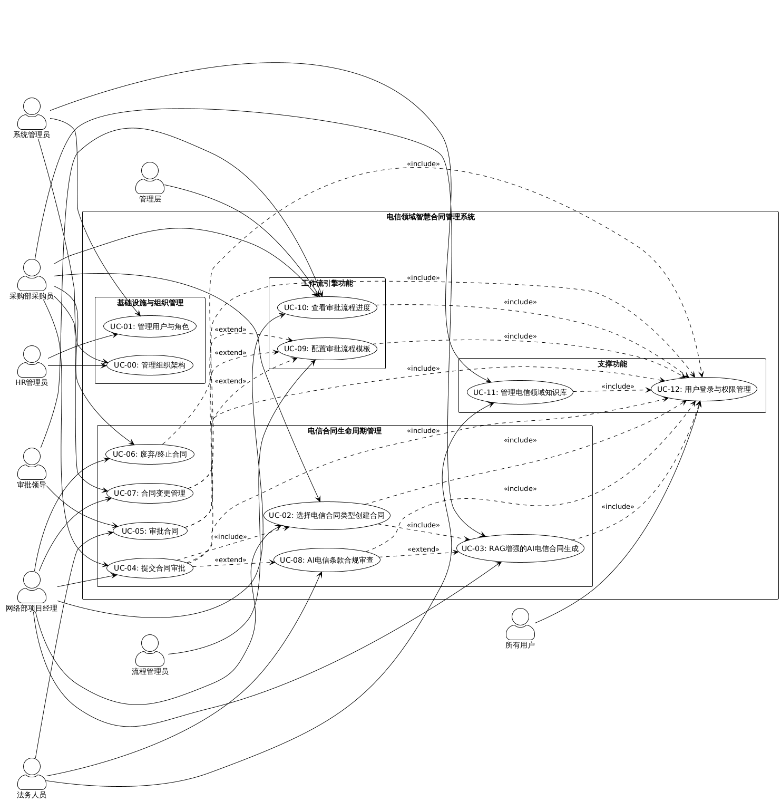

**用例图说明**：

1. **参与者（Actors）**：
   - **系统管理员**：负责组织架构、用户角色和知识库管理
   - **HR管理员**：协助管理组织架构和用户信息
   - **网络部项目经理**：创建和管理Type A工程施工合同
   - **运维部项目经理**：创建和管理Type B代维服务合同
   - **IT部项目经理**：创建和管理Type C IT服务合同
   - **审批领导**：审批合同任务
   - **法务人员**：执行AI合规审查和管理知识库
   - **流程管理员**：配置审批流程模板
   - **管理层**：查看审批流程进度
   - **所有用户**：使用登录与权限管理功能

2. **用例分组**：
   - **基础设施与组织管理**：UC-00、UC-01，为系统提供组织架构和用户基础
   - **电信合同生命周期管理**：UC-02至UC-08，覆盖合同从创建到审查的全流程
   - **工作流引擎功能**：UC-09、UC-10，提供灵活的审批流程配置和进度查看
   - **支撑功能**：UC-11、UC-12，提供知识库管理和用户认证授权

3. **用例关系**：
   - **<<include>>关系**：表示一个用例必须包含另一个用例的行为（如所有业务用例都包含登录）
   - **<<extend>>关系**：表示一个用例可以扩展另一个用例的行为（如提交审批可触发AI审查）

---

### 4.1 基础设施与组织管理

#### 4.1.1 用例UC-00：管理组织架构

**用例标识**：UC-00

**用例名称**：管理组织架构

**主要参与者**：系统管理员、HR管理员

**优先级**：P0（必须实现）

**前置条件**：
- 用户已登录系统
- 用户具有"组织管理"权限

**业务价值**：
组织架构是整个系统的基础，支撑树状审批策略和权限管理。中国移动采用**省-市-县三级法人架构**，但由于省级职能部门与市级分公司平级、市级职能部门与县级分公司平级，因此组织树结构呈现**四级层级**（1=省公司，2=省级职能部门/市级分公司，3=市级职能部门/县级分公司，4=县级职能部门）。本用例用于维护这一组织树结构。

**基本流程**：

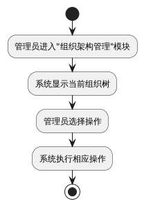

**核心操作**：

**操作A：创建部门**
- 输入：部门名称、部门代码、上级部门、部门类型（省公司/地市/区县/职能部门）
- 验证：部门代码唯一性、上级部门存在性
- 结果：部门节点插入组织树

**操作B：编辑部门**
- 可修改：部门名称、部门负责人
- 不可修改：部门代码（防止引用失效）
- 谨慎修改：上级部门（会影响所有子部门的审批路径）

**操作C：删除部门**
- 前置检查：
  - 该部门下无子部门
  - 该部门下无用户
  - 该部门未被流程模板引用
- 若检查不通过，提示停用而非删除

**操作D：调整组织树结构**
- 支持拖拽节点调整层级关系
- 系统自动更新所有受影响用户的审批路径

**典型组织树示例（三级法人架构，四级层级结构）**：

**说明**：从法人实体角度看是省-市-县三级，但由于职能部门的存在，组织树呈现四级层级：
- 省级职能部门与市级分公司平级（同为第2级）
- 市级职能部门与县级分公司平级（同为第3级）

```
第1级：省公司（根节点）
  ├─ 第2级：省级职能部门（6个核心部门，与市级分公司平级）
  ├─ 第2级：市级分公司（N个，与省级职能部门平级）
       ├─ 第3级：市级职能部门（7个标准部门，与县级分公司平级）
       ├─ 第3级：县级分公司（M个，与市级职能部门平级）
            └─ 第4级：县级职能部门（4个精简部门）
```

**市级部门设置（7个标准部门）**：

| 部门代码 | 部门名称 | 主要职责 |
| :--- | :--- | :--- |
| CITY-X-NET | 网络部 | 网络运维、基站建设、代维管理 |
| CITY-X-GOV | 政企客户部 | B2B业务、DICT项目 |
| CITY-X-LEGAL | 法务部 | 合同法务审查 |
| CITY-X-FIN | 财务部 | 成本审计、财务审核 |
| CITY-X-PROC | 采购部 | 供应商管理、采购审查 |
| CITY-X-ADMIN | 综合部 | 人事、行政、印章管理 |
| CITY-X-MKT | 市场经营部 | B2C业务、渠道管理 |

**县级部门设置（4个精简部门）**：

| 部门代码 | 部门名称 | 主要职责 |
| :--- | :--- | :--- |
| COUNTY-X-NET | 网络部 | 网络维护、故障处理 |
| COUNTY-X-GOV | 政企部 | 政企客户拓展 |
| COUNTY-X-ADMIN | 综合部 | 人事、行政、财务报账 |
| COUNTY-X-MKT | 市场部 | 营销、渠道拓展 |

**业务规则**：
- BR-100：组织树必须有且仅有一个根节点（省公司）。
- BR-101：部门层级不得超过6级。
- BR-102：部门代码格式遵循规范：CITY-X-NET, COUNTY-X-NET等。
- BR-103（单一法人实体规则）：县级分公司必须隶属于市级分公司，且县级部门发起流程时必须能自动路由至市级对应职能部门。

**后置条件**：
- 组织树结构已更新
- 相关用户的审批路径自动重新计算
- 操作日志已记录

---

#### 4.1.2 用例UC-01：管理用户与角色

**用例标识**：UC-01

**用例名称**：管理用户与角色

**主要参与者**：系统管理员、HR管理员

**优先级**：P0（必须实现）

**前置条件**：
- 用户已登录系统
- 用户具有"用户管理"权限
- 组织架构已建立

**业务价值**：
用户管理是审批流程的基础。系统需要明确每个用户的所属部门、直接上级、角色权限，才能正确执行树状审批策略和权限控制。

**基本流程**：

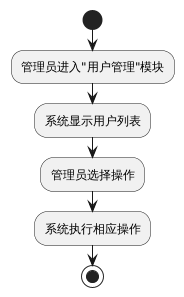

**核心操作**：

**操作A：创建用户**
- 基本信息：用户名、姓名、工号、邮箱、手机号
- 组织信息：**所属部门**（必填）、**直接上级**（必填，用于树状审批）
- 角色分配：系统角色（单选或多选）
- 系统自动生成初始密码

**操作B：配置用户组织关系**
- **所属部门**：确定用户在组织树中的位置
- **直接上级**：明确汇报关系，树状审批时沿此路径向上流转
- **兼职部门**（可选）：用户可能同时在多个部门工作

**操作C：分配角色**
- 系统采用双重角色架构：
  - **系统基础角色（role字段）**：用于系统权限控制，包括ADMIN（系统管理员）、STAFF（工作人员）、BOSS（领导层）
  - **业务审批角色（primaryRole字段）**：用于工作流审批匹配，关联sys_role表的角色编码，如PROJECT_MANAGER（项目经理）、LEGAL_REVIEWER（法务审查员）等
- 系统预定义审批角色（完整角色表）：

| 角色代码 | 角色名称 | 权限级别 | 说明 |
| :--- | :--- | :--- | :--- |
| **INIT** | 县级发起人 | 仅发起 | 县级分公司最基层的发起角色 |
| **PM** | 项目经理 | 技术审查 | 负责工程技术审核 |
| **CA** | 成本审计 | 财务合规 | 负责工程造价审核 |
| **DR** | 设计审查 | 技术标准 | 负责装修工程技术审查 |
| **NE** | 网络工程师 | 技术审查 | 光缆代维技术审查 |
| **NP** | 网络规划 | 战略对齐 | 光缆代维规划审查 |
| **RF** | 射频工程师 | 技术审查 | 基站代维技术审查 |
| **SA** | 站点获取 | 物业审查 | 基站选址与租赁审查 |
| **FC** | 设施协调员 | 设施管理 | 零星维修审查 |
| **BS** | 家宽专家 | 技术审查 | 家宽代维技术审查 |
| **CSL** | 客服主管 | 服务审查 | 客服影响度审查 |
| **OC** | 运营中心 | 应急调度 | 应急保障流程快速通道 |
| **TL** | 技术负责人 | 代码审查 | IT开发技术把关 |
| **SR** | 安全审查 | 安全合规 | IT类项目强制安全审查 |
| **IA** | IT架构 | 架构审查 | 系统架构合理性审查 |
| **PS** | 采购专员 | 采购审查 | 采购流程合规性 |
| **VM** | 供应商管理 | 资质审查 | 供应商准入资质 |
| **CSA** | 解决方案架构师 | 技术审查 | DICT项目技术方案 |
| **FRC** | 财务应收检查 | 收入验证 | C3 DICT集成项目专用 |
| **DPM** | DICT项目经理 | 项目治理 | DICT项目交付管理 |
| **LR** | 法务审查 | 合同合规 | 负责法律条款审核 |
| **DM** | 部门经理 | 部门审批 | 第一级行政审批 |
| **VP** | 副总经理 | 执行审批 | Tier 2 级终审人 |
| **T1M** | 三重一大会议 | 集体决策 | Tier 4 级必须的前置节点 |
| **GM** | 总经理 | 最终权限 | Tier 3/4 级终审人 |

**操作D：配置审批权限**
- 否决权配置：指定哪些用户在审批时可以行使"否决"操作
- 通常授予：部门总监及以上级别、法务负责人、财务负责人

**操作E：批量导入**
- 支持Excel批量导入用户
- 模板包含：用户名、姓名、工号、部门代码、上级工号、角色
- 系统自动验证并建立关联

**典型用户配置示例**：

| 姓名 | 部门 | 直接上级 | 角色 | 是否有否决权 |
|------|------|---------|------|-------------|
| 张三 | 网络建设部-无线网络处 | 李四 | 普通用户 | 否 |
| 李四 | 网络建设部-无线网络处 | 王五 | 审批人 | 否 |
| 王五 | 网络建设部 | 赵六 | 审批人 | 是（部门总监） |
| 赵六 | 省公司 | - | 审批人 | 是（分管副总） |

**审批路径自动推导**：
当张三创建合同并提交审批（使用树状审批策略）时，系统自动确定审批路径：
1. 第一级审批人：李四（张三的直接上级）
2. 第二级审批人：王五（李四的直接上级）
3. 第三级审批人：赵六（王五的直接上级）

**业务规则**：
- BR-110：每个用户必须指定所属部门
- BR-111：每个用户必须指定直接上级（根节点除外）
- BR-112：直接上级必须是上级部门或同部门的用户
- BR-113：用户名必须唯一
- BR-114：工号必须唯一

**扩展流程**：

E1：循环上级检测
- 系统检测到A的上级是B，B的上级是A（循环引用）
- 系统拒绝保存并提示错误

E2：用户离职处理
- 停用账号（不删除，保留历史记录）
- 将其作为审批人的待办任务转交给其上级
- 将其作为直接上级的下属重新分配

**后置条件**：
- 用户账号已创建
- 组织关系已建立
- 角色权限已分配
- 审批路径可自动计算
- 操作日志已记录

---

### 4.2 电信合同生命周期管理

#### 4.2.1 用例UC-02：选择电信合同类型创建合同

**用例标识**：UC-02

**用例名称**：选择电信合同类型创建合同

**主要参与者**：网络部项目经理、采购部采购员

**优先级**：P0（必须实现）

**前置条件**：
- 用户已登录系统
- 用户具有"合同创建"权限

**基本流程**：

1. 用户点击"创建合同"按钮，系统显示电信合同类型选择界面
2. 用户选择合同类型（Type A - 工程施工 / Type B - 代维服务 / Type C - IT服务）
3. 系统显示创建方式选项（AI对话式生成、使用标准模板、上传文件）
4. 用户选择创建方式并填写/生成合同内容
5. 系统自动校验必填字段，若不通过则提示用户补充
6. 用户点击"保存"
7. 系统生成合同编号，保存合同数据为"草稿"状态

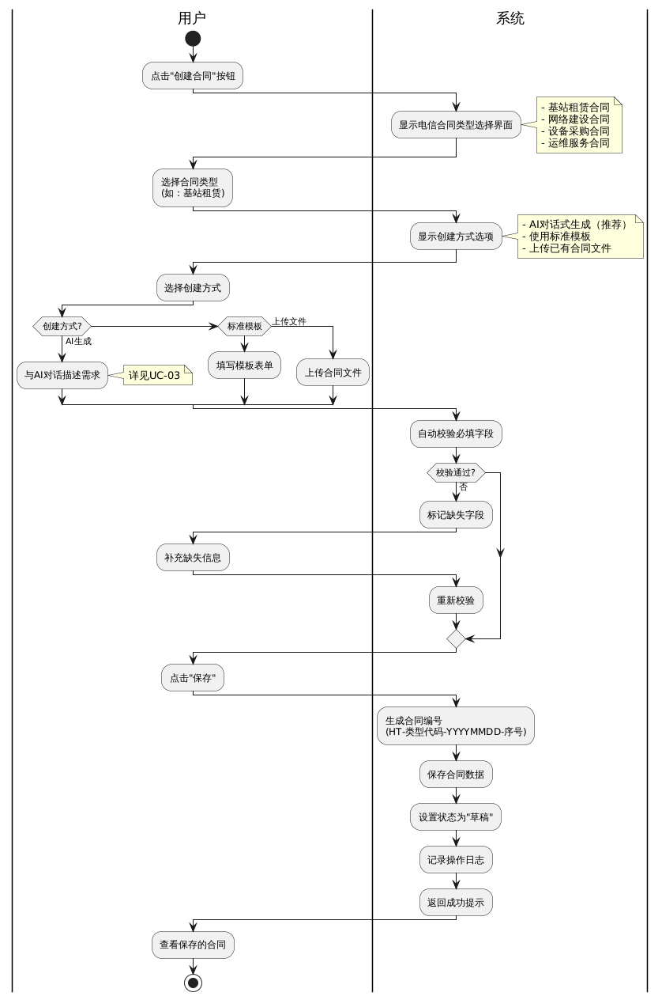


**合同类型选项**：
- Type A - 工程施工合同
- Type B - 代维服务合同
- Type C - IT服务合同

**创建方式选项**：
- AI对话式生成（推荐）
- 使用标准模板
- 上传已有合同文件

**业务规则**：
- BR-001：合同编号格式为HT-类型代码-YYYYMMDD-序号
- BR-002：Type A工程施工合同必须包含"审计结算"条款
- BR-003：Type B代维服务合同必须包含"SLA考核"附件
- BR-004：Type C IT服务合同必须包含"数据安全承诺"附件

**后置条件**：
- 合同记录已创建，状态为"草稿"
- 合同类型已标记
- 操作日志已记录

---

#### 4.2.2 用例UC-03：RAG增强的AI电信合同生成

**用例标识**：UC-03

**用例名称**：RAG增强的AI电信合同生成

**主要参与者**：网络部项目经理、运维部项目经理、IT部项目经理

**次要参与者**：LLM API服务、RAG向量检索服务

**优先级**：P1（应该实现）

**前置条件**：
- 用户已登录系统
- 用户已选择合同类型
- LLM API服务可用
- 中国移动领域知识库已初始化（包含Type A/B/C合同模板、审查规则文档、法律法规等）
- RAG向量检索服务可用

**核心技术架构**：

1. 领域增强提示词注入：系统注入电信领域背景知识
2. RAG向量检索：用户输入经过向量化后在Chroma数据库中检索相关内容
3. 构建增强提示词：System Prompt + RAG检索结果 + 用户输入
4. 调用LLM API生成：调用大语言模型生成合同内容
5. 后处理与验证：解析JSON、验证必填字段、检查术语准确性

**AI对话模式**：

系统支持两种AI对话模式：
- **ASK模式**：问答模式，AI仅提供咨询和建议，不直接修改合同内容。适用于用户询问合同条款、法律法规、最佳实践等问题。
- **AGENT模式**：执行模式，AI可以直接执行修改操作，如添加条款、修改内容、调整格式等。AI会返回具体的修改动作（如INSERT、REPLACE、DELETE），系统自动应用到合同内容中。

用户可以在两种模式间自由切换，同一会话中支持模式切换。

**基本流程**：

1. 用户点击AI生成，系统创建AI会话并显示AI对话界面
2. 用户选择对话模式（ASK或AGENT，默认为ASK）
3. 用户输入合同需求描述或修改指令
4. 系统调用RAG检索服务，从向量数据库检索相关电信领域知识
5. 系统构建增强提示词（包含检索结果和用户输入）
6. 系统调用LLM API生成回复或执行修改
7. 如果是ASK模式：系统展示AI回复给用户
8. 如果是AGENT模式：系统展示AI回复并自动应用修改到合同内容，用户可查看修改详情并选择撤销
9. 用户继续对话或确认修改
10. 用户保存合同为草稿状态

**扩展说明**：
- 系统还提供独立的AI问答功能（/ai/qa页面），仅支持ASK模式，用于一般性的合同或工作相关问题咨询，不涉及具体合同的修改。

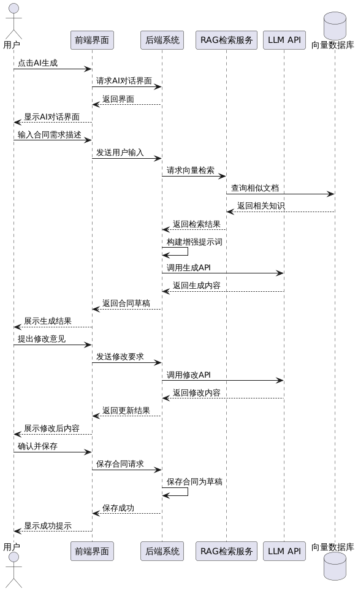

**扩展流程**：

E1：LLM API调用失败
- 系统自动切换到模板填写模式
- 不阻断业务流程

E2：RAG检索无结果
- 依赖LLM自身的通用知识生成
- 标记提示用户重点审查

**业务规则**：
- BR-010：单次AI生成的token消耗不得超过4096
- BR-011：RAG检索结果相似度阈值为0.5及以上
- BR-012：生成失败时不阻断业务流程

**后置条件**：
- 合同草稿已创建并保存
- AI生成日志已记录
- RAG检索到的知识库内容ID已关联到合同

---

#### 4.2.3 用例UC-04：提交合同审批

**用例标识**：UC-04

**用例名称**：提交合同审批

**主要参与者**：网络部项目经理、运维部项目经理、IT部项目经理

**次要参与者**：审查规则引擎、审批流程引擎、AI审查服务

**优先级**：P0（必须实现）

**前置条件**：
- 用户已登录系统
- 合同已创建并处于"草稿"状态
- 合同必填字段已完整填写
- 已存在匹配的流程模板

**基本流程**：

1. 用户点击"提交审批"
2. 系统检查合同完整性，若不通过则提示缺失字段
3. **系统调用审查规则引擎（Pre-Flight Check）**：
   - 检查必须附件是否齐全（根据合同类型Type A/B/C）
   - 检查数值逻辑是否正确（安全费比例、质保金比例等）
   - 如果不通过 → 阻止提交，显示具体错误
   - 如果通过 → 继续
4. **系统调用审批流程引擎（Workflow Matching）**：
   - 根据合同类型、金额等属性匹配审批流程模板
   - 创建流程实例，确定第一个审批节点的审批人
5. 系统创建审批任务并通知审批人
6. 系统更新合同状态为"审批中"
7. **系统异步触发AI审查**（不阻塞审批流程）：
   - 调用AI服务生成风险审查报告
   - 保存审查报告到数据库
   - 供审批人参考

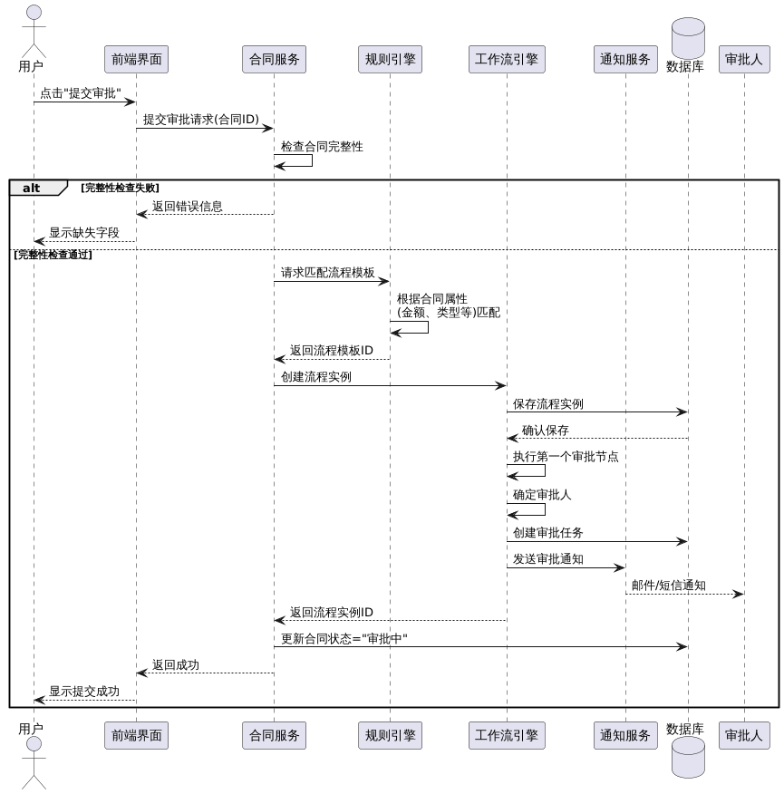

**审查规则引擎检查示例**（Pre-Flight Check）：

系统根据以下规则代码执行硬性检查：

| 规则代码 | 合同类型 | 检查项 | 级别 | 缺失/错误动作 |
| :--- | :--- | :--- | :--- | :--- |
| **DOC_A_001** | Type A | 安全生产协议 | CRITICAL | **阻断提交** |
| **DOC_A_002** | Type A | 廉洁诚信承诺 | CRITICAL | **阻断提交** |
| **DOC_A_003** | Type A | 农民工工资账户 | CRITICAL | **阻断提交** |
| **DOC_A_004** | Type A | 履约保证金凭证 | HIGH | 警告确认 |
| **DOC_B_001** | Type B | 技术规范书 | CRITICAL | **阻断提交** |
| **DOC_B_002** | Type B | 考核细则 | CRITICAL | **阻断提交** |
| **DOC_B_003** | Type B | 报价明细 | CRITICAL | **阻断提交** |
| **DOC_B_004** | Type B | 安全生产责任书 | CRITICAL | **阻断提交** |
| **DOC_C_001** | Type C | 数据安全承诺 | CRITICAL | **阻断提交** |
| **DOC_C_002** | Type C | 开源软件承诺 | CRITICAL | **阻断提交** |
| **DOC_C_003** | Type C | SLA服务等级 | HIGH | 警告确认 |
| **DOC_C_005** | Type C | 廉洁承诺 | CRITICAL | **阻断提交** |
| **LOGIC_A_01** | Type A | 安全费比例 ≥ 1.5% | CRITICAL | **阻断提交** |
| **LOGIC_A_02** | Type A | 质保金比例 = 3% | CRITICAL | **阻断提交** |
| **LOGIC_C_01** | Type C | DICT项目背靠背条款 | CRITICAL | **阻断提交** |

**审批流程引擎匹配示例**（Workflow Matching）：

| 条件 | 匹配流程 |
|------|---------|
| Type A + 金额<5万 | 简易审批流程 |
| Type A + 金额5-50万 | 标准审批流程 |
| Type A + 金额≥50万 | 重大审批流程 |
| Type B + 金额≥50万 | 重大审批流程（含法务会签） |
| Type C + 金额≥50万 | 重大审批流程（含法务会签，重点关注数据安全） |

**注意**：具体规则配置需等待审批流程引擎和审查规则引擎设计方案完成后确定。

**扩展流程**：

E1：未找到匹配的流程模板
- 系统提示"未找到适用的审批流程，请联系流程管理员"
- 阻止提交

E2：需要多部门会签
- 系统为每个参与部门或角色生成独立的审批任务
- 所有任务共用同一并行组标识

**业务规则**：
- BR-020：审查规则引擎检查不通过，必须阻止提交（硬性阻断）
- BR-021：必须存在匹配的流程模板才能提交审批
- BR-022：会签节点需全部通过才能继续流转
- BR-023：任一会签任务驳回则流程退回，一旦合同被驳回并由发起人修改了内容，所有已通过的审批节点（含会签中已表态的部门）状态全部重置，必须重新审批
- BR-024：AI审查失败不阻断审批流程（异步执行，失败不影响审批）

**后置条件**：
- 合同状态更新为"审批中"
- 流程实例已创建
- 审批任务已创建并分配
- 审批人收到通知

---

#### 4.2.4 用例UC-05：审批合同

**用例标识**：UC-05

**用例名称**：审批合同

**主要参与者**：审批领导、法务人员

**次要参与者**：工作流引擎

**优先级**：P0（必须实现）

**前置条件**：
- 审批人已登录系统
- 审批人有待处理的审批任务

**基本流程**：

1. 审批人查看待办任务列表，点击某个审批任务
2. 系统显示合同详情、审批信息、审批历史
3. **系统显示AI审查报告**（如果已生成）：
   - 风险等级（低/中/高）
   - 综合评分（0-100分）
   - 高风险项列表及修改建议
   - 中风险项列表及修改建议
   - 低风险项列表及修改建议
4. 审批人阅读合同内容和AI审查报告，做出审批决策（同意/驳回/否决）
4. 审批人填写审批意见并提交
5. 系统根据决策类型执行相应操作：同意则流转至下一节点，驳回则退回发起人，否决则终止流程
6. 系统记录审批日志，更新合同状态，通知相关人员

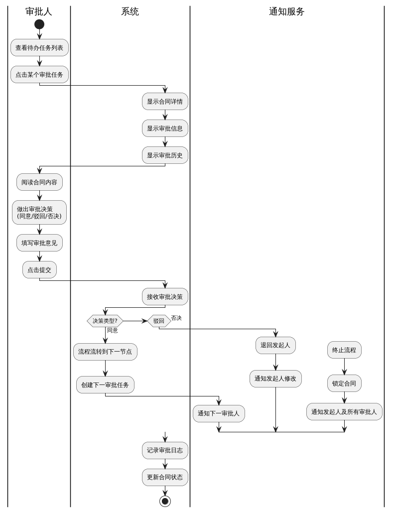

**审批决策选项**：
- 同意：填写审批意见，点击"通过"，流程按引擎确定的路径继续流转
- 驳回：填写驳回原因，点击"驳回"，退回起草人重写合同
- 否决：认为合同商业逻辑不可行、风险过高或项目取消，点击"否决"，直接终止流程（需要特权，由工作流引擎配置时指定）

**审批结果处理**：

普通审批节点：
- 通过：流程流转到下一节点
- 驳回：流程退回到指定节点或发起人
- 否决：
    - 系统将流程实例状态更新为"已终止"
    - 系统将合同状态更新为"已终止"
    - 系统锁定该合同，禁止编辑和重新提交（如需重启需复制创建新合同）
    - 向发起人及所有已审批人发送终止通知

会签节点：
- 通过：标记当前任务为"已通过"，检查会签规则
- 如果满足条件（如全部通过），流程继续流转
- 如果不满足，等待其他审批人
- 驳回：根据节点配置执行驳回逻辑
- 否决：任意具有否决权的会签人点击否决，整个流程立即终止

**扩展流程**：

E1：会签中有人驳回
- 系统根据节点配置执行驳回逻辑
- 默认整个流程退回发起人

**后置条件**：
- 审批任务状态已更新
- 如果流程流转，下一审批人收到通知
- 如果流程结束，合同状态更新为"已生效"或"已驳回"
- 审批日志已记录

---

#### 4.2.5 用例UC-06：废弃/终止合同

**用例标识**：UC-06

**用例名称**：废弃/终止合同

**主要参与者**：合同发起人（网络部项目经理、采购员）

**优先级**：P1（应该实现）

**前置条件**：
- 合同处于"草稿"或"审批中"状态
- 用户是该合同的发起人

**业务场景**：
- 场景A：与乙方谈判破裂，对方条件无法接受，不再继续签署。
- 场景B：内部计划变更，项目取消，不再需要该合同。

**基本流程**：

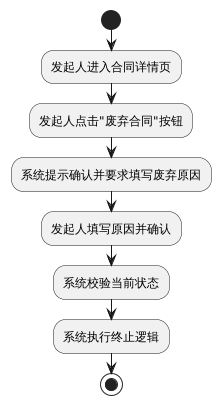

**终止逻辑**：
- 若合同在"审批中"：系统强制结束工作流实例，状态设为"已终止"
- 若合同在"草稿"：系统将合同状态直接设为"已作废"
- 记录操作日志及废弃原因

**后置条件**：
- 合同状态变更为"已终止"或"已作废"
- 流程实例（如有）已结束
- 合同变为只读归档状态

---

#### 4.2.6 用例UC-07：合同变更管理

**用例标识**：UC-07

**用例名称**：合同变更管理

**主要参与者**：合同发起人、网络部项目经理

**次要参与者**：工作流引擎、审批领导

**优先级**：P1（应该实现）

**前置条件**：
- 用户已登录系统
- 合同状态为"已生效"
- 用户是该合同的创建者（creatorId）或参与过该合同的审批流程（系统支持两种权限来源）

**业务背景**：

电信合同在履约过程中经常需要变更。根据行业统计，Type A工程施工类合同变更率高达40%。系统需要支持合同变更的规范化管理。

**注**：合同"已生效"状态即表示合同正在执行中，可以进行变更管理。

**典型业务场景**：

**场景A：Type A工程施工合同变更**
- 金额变更（设计变更导致工程量增减，需重新审计结算）
- 工期调整（天气、疫情等不可抗力因素）
- 技术方案调整（建设方案变更，需技术评审）

**场景B：Type B代维服务合同变更**
- 框架上限变更（业务扩展，服务金额上限调整）
- SLA指标变更（服务等级要求调整）
- 人员配置变更（代维人员要求调整）

**场景C：Type C IT服务合同变更**
- 功能需求变更（开发范围调整）
- 交付时间变更（项目周期调整）
- 数据安全要求变更（安全标准调整）

**变更发起方式说明**：

本系统仅支持甲方（中国移动）员工在系统中发起变更，原因如下：
1. 乙方（施工单位、代维公司、IT服务商）不使用本系统（符合1.2.6项目范围排除）
2. 乙方提出变更需求 → 通过邮件/电话/会议沟通 → 甲方员工在系统中记录并发起
3. 在"变更原因"字段中注明"应乙方要求"

**基本流程**：

1. 发起人进入已生效合同详情页，点击"申请变更"
2. 系统检查合同状态和用户权限，创建变更草稿
3. 发起人修改需要变更的字段，填写变更类型、原因和说明
4. 发起人提交变更申请
5. 系统生成变更对比视图，计算变更幅度，判定是否为重大变更
6. 系统根据变更类型匹配审批流程，创建审批流程实例
7. 审批人审批变更申请，系统根据审批结果更新合同或驳回
8. 若审批通过，系统更新合同内容，生成《合同变更协议》PDF
9. 发起人下载变更协议，发送给乙方签署并上传签署版
10. 系统归档签署版，变更正式生效，记录变更历史

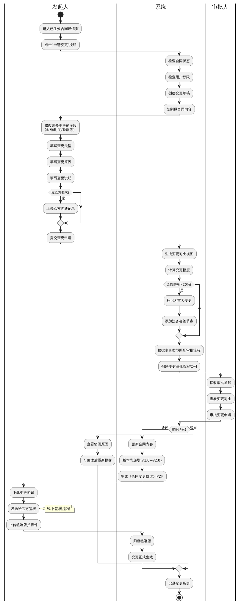

**变更信息填写**：

| 字段 | 说明 | 是否必填 |
|------|------|---------|
| 变更类型 | 金额变更、时间变更、技术方案变更、附件补充、联系人变更、其他 | 是 |
| 变更原因 | 本方主动、应乙方要求、不可抗力、政策调整、其他 | 是 |
| 变更说明 | 详细描述变更内容和必要性 | 是 |
| 乙方沟通记录 | 若应乙方要求，记录沟通情况（邮件截图、会议纪要等） | 否 |
| 附件 | 变更相关的支撑材料 | 否 |

**变更类型与审批规则**：

| 变更类型 | 是否需要审批 | 审批路径确定规则 |
|---------|-------------|-----------------|
| 金额增加 | 是（必须） | 按变更后总金额匹配审批流程 |
| 金额减少 | 是 | 按原审批流程执行 |
| 时间延长/提前 | 是 | 按原审批流程执行 |
| 技术方案变更 | 是（需技术评审） | 原审批流程+技术部门会签 |
| 附件补充 | 否 | 直接归档，无需审批 |
| 联系人变更 | 否 | 直接更新，记录日志 |

**重大变更判定**（需特别审批）：

满足以下任一条件视为重大变更，需增加法务会签：
- 金额增加超过原金额的20%
- 履约期限延长超过6个月
- 核心技术指标变更（如网络覆盖率、SLA指标）
- 付款方式重大调整

**变更对比展示**：

系统自动生成变更前后对比表：

| 字段 | 变更前 | 变更后 | 变更幅度 |
|------|--------|--------|---------|
| 合同金额 | 100万元 | 120万元 | +20万元（+20%） |
| 履约期限 | 2025-01-01至2025-12-31 | 2025-01-01至2026-06-30 | 延长6个月 |
| 网络覆盖率 | 95% | 98% | +3% |
| 支付方式 | 按月支付 | 按季支付 | 已变更 |

**审批流程匹配逻辑**：

```
IF 变更类型 = "附件补充" OR "联系人变更" THEN
    无需审批，直接生效
ELSE IF 变更类型 = "金额增加" THEN
    新金额 = 原金额 + 增加金额
    IF 新金额 >= 50万 AND 原金额 < 50万 THEN
        升级为"重大审批流程"（需总裁审批）
    ELSE IF 新金额增幅 > 20% THEN
        在原流程基础上增加"法务会签"节点
    ELSE
        使用原审批流程
    END IF
ELSE IF 变更类型 = "技术方案变更" THEN
    在原流程基础上增加"技术部门会签"节点
ELSE
    使用原审批流程
END IF
```

**变更历史追踪**：

系统为每个合同维护完整的变更历史：

| 版本 | 变更时间 | 变更人 | 变更类型 | 变更摘要 | 审批记录 |
|------|---------|--------|---------|---------|---------|
| v1.0 | 2024-01-01 | - | 原始版本 | 合同初次签署 | 查看 |
| v2.0 | 2024-06-15 | 张三 | 金额变更 | 应乙方要求增加工程量，金额+20万 | 查看 |
| v3.0 | 2024-09-20 | 李四 | 时间变更 | 不可抗力因素，工期延长3个月 | 查看 |

用户可点击任一版本查看该版本的完整合同内容和审批流程。

**业务规则**：
- BR-130：合同在"审批中"、"已驳回"、"已终止"、"已作废"状态时不能发起变更
- BR-131：同一合同只能有一个"变更审批中"的申请，必须完成或撤销后才能发起新变更
- BR-132：金额增加超过原金额20%的变更，自动标记为"重大变更"并增加法务会签
- BR-133：变更审批通过后，系统自动生成《合同变更协议》（版本号递增）
- BR-134：变更后的合同金额若触发审批流程升级，必须重新走新的审批流程
- BR-135：附件补充和联系人变更无需审批，直接生效并记录日志

**扩展流程**：

E1：变更被驳回
- 系统将变更申请状态设为"已驳回"
- 原合同保持"已生效"状态不变
- 发起人可查看驳回原因
- 发起人可修改后重新提交或撤销变更申请

E2：变更导致审批流程升级
- 系统提示"变更后金额已超出原审批范围，需升级审批流程"
- 自动匹配新的审批流程（如从"标准流程"升级为"重大流程"）
- 审批路径增加高层领导（如总裁审批）

E3：发起人撤销变更
- 变更申请在"草稿"或"审批中"状态时可撤销
- 系统终止审批流程实例
- 原合同状态不变

**后置条件**：

审批通过后：
- 原合同版本号递增（如v1.0 → v2.0）
- 合同内容已更新为变更后版本
- 系统生成《合同变更协议》PDF文档
- 变更历史已完整记录
- 若金额变更，相关统计数据自动更新

审批驳回后：
- 原合同状态不变
- 变更申请状态设为"已驳回"
- 驳回原因已记录

**与乙方的交互**（系统外流程）：

1. 系统生成《合同变更协议》PDF
2. 甲方通过邮件发送给乙方
3. 乙方线下签字盖章（纸质或电子签章）
4. 甲方将签署版扫描件上传至系统归档
5. 变更正式生效

**注意事项**：
- 本系统不支持乙方在线签署（符合1.2.6项目范围排除）
- 乙方签署通过线下方式完成
- 签署完成后由甲方员工上传至系统

---

#### 4.2.7 用例UC-08：AI电信条款合规审查

**用例标识**：UC-08

**用例名称**：AI电信条款合规审查

**主要参与者**：法务人员、系统自动触发

**次要参与者**：LLM API服务、RAG向量检索服务

**优先级**：P1（应该实现）

**前置条件**：
- 合同已创建完成
- 合同内容不为空
- LLM API服务可用（可降级）

**触发条件**：
- 自动触发：合同提交审批时
- 手动触发：法务人员点击"AI条款审查"按钮

**审查规则引擎（Pre-Flight Check）**：
- **必须附件检查**：根据合同类型（Type A/B/C）检查必须附件是否齐全
- **数值逻辑校验**：检查安全费比例、质保金比例、框架上限等数值是否符合规范
- **基础合规检查**：检查签名、盖章等基础合规要求

**AI审查服务（Risk Report）**：
基于设计规范文档（`ai-service/design_specs/Workflow_Review_Engine_Type_*.md`）进行语义风险扫描：

维度一：Type A（工程施工）风险检查
- 违法转包风险（RISK_A_001）
- 安全责任转移风险（RISK_A_002）
- 审计拒绝风险（RISK_A_007）
- 环境违规风险（RISK_A_004）

维度二：Type B（代维服务）风险检查
- 伪造记录风险（RISK_B_001）
- 甲供材管理风险（RISK_B_004）
- 框架上限超限风险
- SLA考核缺失风险

维度三：Type C（IT服务）风险检查
- 数据出境风险（RISK_C_001）
- GPL许可证风险（RISK_C_002）
- 知识产权归属风险（RISK_C_003）
- 数据本地化缺失风险

维度四：法规合规性检查
- 是否符合《电信条例》要求
- 是否符合《数据安全法》《个人信息保护法》要求
- 是否符合中国移动内部管理办法

**基本流程**：

1. 系统触发AI审查（自动：提交审批时；手动：法务人员点击"AI条款审查"按钮）
2. AI审查服务读取合同内容，确定合同类型（Type A/B/C）
3. 系统调用RAG检索服务：
   - 检索对应类型的设计规范文档（`Workflow_Review_Engine_Type_*.md`）
   - 检索相关法律法规（《电信条例》《数据安全法》等）
   - 检索中国移动内部管理办法
4. 系统构建审查提示词（设计规范规则 + 法规 + 合同内容）
5. 系统调用LLM API进行合规审查，分析语义风险维度
6. 系统生成风险审查报告（风险等级、评分、风险项列表、修改建议）
7. 系统保存审查报告到数据库
8. 系统通知法务人员，法务人员查看报告并决策

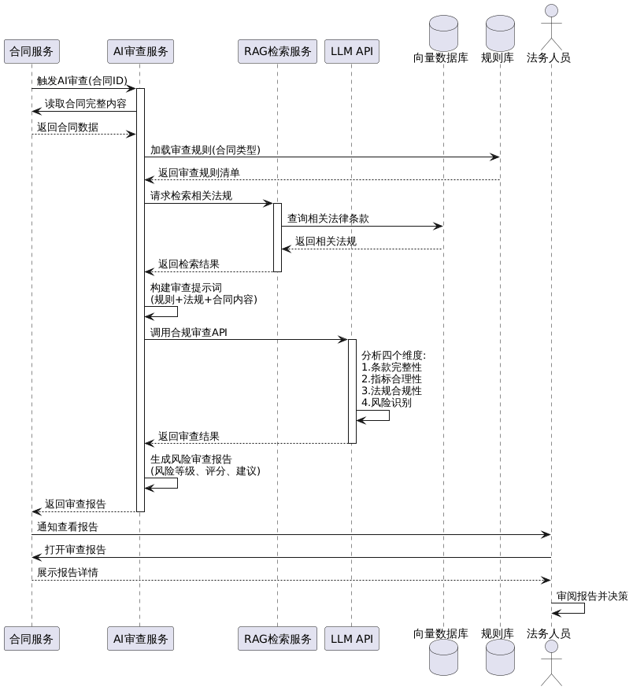

**审查报告内容**：
- 风险等级：低、中、高
- 综合评分：0至100分
- 高风险项列表及修改建议
- 中风险项列表及修改建议
- 低风险项列表及修改建议
- 已包含的优质条款

**扩展流程**：

E1：LLM API调用超时或失败
- 系统记录错误日志
- 审批流程正常进行（不阻断）
- 法务人员可以手动触发重新审查

**业务规则**：
- BR-050：高风险合同必须由法务人员审查后才能通过
- BR-051：AI审查失败不阻断审批流程（异步执行，失败不影响审批）
- BR-052：人工可以否决AI建议，但需说明理由
- BR-053：审查规则引擎检查不通过，必须阻止提交（硬性阻断）
- BR-054：AI审查报告作为辅助参考，最终决策权在审批人

**后置条件**：
- 风险审查报告已生成并保存
- 风险条款已在合同中标记
- 审查日志已记录

---

### 4.3 工作流引擎功能

#### 4.3.1 用例UC-09：配置审批流程模板

**用例标识**：UC-09

**用例名称**：配置审批流程模板

**主要参与者**：流程管理员

**优先级**：P1（应该实现）

**前置条件**：
- 用户具有"流程管理员"角色

**基本流程**：

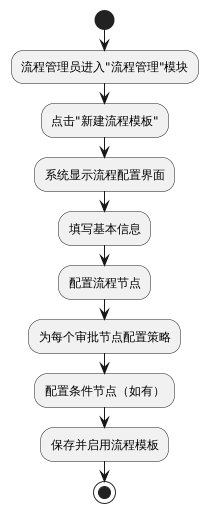

**基本信息**：
- 流程名称
- 适用条件（合同金额范围、合同类型等）

**节点类型**：
- 开始节点
- 审批节点
- 会签节点
- 条件节点
- 结束节点

**节点配置项**：
- 节点类型
- 审批策略（树状上报、指定角色、全局角色）
- 会签规则（全部通过、多数通过）
- 驳回配置（退回发起人、退回上一节点）

**业务规则**：
- BR-060：流程模板必须包含开始和结束节点
- BR-061：会签节点必须指定会签规则
- BR-062：已被使用的流程模板不能删除，只能停用

**后置条件**：
- 流程模板已创建并保存
- 流程模板可用于合同审批

---

#### 4.3.2 用例UC-10：查看审批流程进度

**用例标识**：UC-10

**用例名称**：查看审批流程进度

**主要参与者**：合同发起人、审批人、管理层

**优先级**：P1（应该实现）

**前置条件**：
- 用户已登录系统
- 合同已提交审批

**基本流程**：

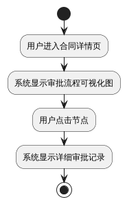

**可视化内容**：
- 流程节点及其状态（已完成、进行中、待处理）
- 各节点审批人及审批时间
- 会签节点各部门审批进度

**后置条件**：
- 无

---

### 4.4 支撑功能

#### 4.4.1 用例UC-11：管理中国移动领域知识库

**用例标识**：UC-11

**用例名称**：管理中国移动领域知识库

**主要参与者**：系统管理员、法务人员

**优先级**：P1（应该实现）

**知识库模块**：
- Type A/B/C合同模板库（框架协议、主合同、附件等）
- 审查规则文档库（`design_specs/Workflow_Review_Engine_Type_*.md`）
- 法律法规库（《电信条例》《数据安全法》《个人信息保护法》等）
- 中国移动内部管理办法（供应商负面行为管理、审计管理办法等）
- 强制附件库（廉洁承诺、安全责任书、保密协议等）

**基本操作**：
- 添加、编辑、删除知识条目
- 批量导入（Excel格式）
- 自动向量化并存入Chroma
- 支持热更新（无需重启系统）

**后置条件**：
- 知识库已更新
- 向量索引已重建

---

#### 4.4.2 用例UC-12：用户登录与权限管理

**用例标识**：UC-12

**用例名称**：用户登录与权限管理

**优先级**：P0（必须实现）

**核心需求**：
- FR-090：系统应提供用户名密码登录功能
- FR-091：系统应使用JWT实现无状态认证
- FR-092：系统应实现RBAC权限模型
- FR-093：系统应支持流程管理员角色

**角色定义**：

| 角色 | 权限 |
|------|------|
| 普通用户 | 创建合同、查看自己的合同、提交审批 |
| 审批人 | 审批分配给自己的任务 |
| 法务人员 | 查看所有合同、执行AI审查 |
| 流程管理员 | 配置流程模板、管理流程定义 |
| 系统管理员 | 管理用户、管理知识库、系统配置 |

---

## 5. 外部接口需求

### 5.1 用户界面需求

| 需求ID | 需求描述 |
|--------|---------|
| UI-001 | 系统应采用响应式设计，支持1366×768及以上分辨率 |
| UI-002 | 系统应使用Element Plus组件库 |
| UI-003 | 电信专业术语应有tooltip提示 |
| UI-004 | 审批流程应有可视化展示 |
| UI-005 | 会签进度应实时显示各部门审批状态 |

### 5.2 软件接口

| 接口名称 | 用途 | 协议 | 超时时间 |
|---------|------|------|---------|
| LLM API | AI合同生成、条款审查 | HTTPS | 30秒 |
| Embedding API | 文本向量化 | HTTPS | 10秒 |
| Chroma | 向量检索 | HTTP | 5秒 |
| MinIO/OSS | 文件存储 | HTTPS | 30秒 |
| SMTP | 邮件通知 | SMTP | 10秒 |

### 5.3 通信接口

| 需求ID | 需求描述 |
|--------|---------|
| CI-001 | 前后端通信应使用RESTful API |
| CI-002 | 数据格式应使用JSON |
| CI-003 | 所有HTTP通信必须使用HTTPS |

---

## 6. 非功能需求

### 6.1 性能需求

| 需求ID | 需求描述 | 指标 |
|-------|---------|------|
| NFR-001 | 用户登录响应时间 | 小于等于1秒 |
| NFR-002 | 合同列表查询响应时间 | 小于等于2秒 |
| NFR-003 | RAG向量检索响应时间 | 小于等于3秒 |
| NFR-004 | AI合同生成时间 | 小于等于30秒 |
| NFR-005 | 审批任务创建时间 | 小于等于2秒 |
| NFR-006 | 流程实例状态更新时间 | 小于等于1秒 |
| NFR-007 | 系统并发用户数 | 支持100并发 |

### 6.2 安全性需求

**身份认证**

| 需求ID | 需求描述 |
|--------|---------|
| NFR-010 | 系统必须要求用户登录后才能访问业务功能 |
| NFR-011 | 密码必须使用BCrypt加密存储 |
| NFR-012 | 登录失败5次后，账号锁定30分钟 |

**权限控制**

| 需求ID | 需求描述 |
|--------|---------|
| NFR-014 | 系统必须实现RBAC权限模型 |
| NFR-015 | 用户只能查看和编辑自己创建的草稿合同 |
| NFR-016 | 流程模板只能由流程管理员配置 |

**数据安全**

| 需求ID | 需求描述 |
|--------|---------|
| NFR-018 | 所有HTTP通信必须使用HTTPS |
| NFR-019 | 敏感字段在日志中应脱敏 |

### 6.3 可靠性需求

| 需求ID | 需求描述 |
|--------|---------|
| NFR-021 | 系统可用性应达到99% |
| NFR-022 | 数据库应每日自动备份 |
| NFR-023 | LLM API调用失败时，应有降级策略 |
| NFR-024 | 工作流引擎应支持流程恢复 |

### 6.4 可维护性需求

| 需求ID | 需求描述 |
|--------|---------|
| NFR-025 | 电信领域知识库应支持热更新 |
| NFR-026 | 流程模板应支持版本管理 |
| NFR-027 | 系统应提供完整的API文档（Swagger） |

### 6.5 审计需求

| 需求ID | 需求描述 |
|--------|---------|
| NFR-030 | 系统须记录每个流程实例的完整生命周期 |
| NFR-031 | 系统须记录每个审批任务的操作日志 |
| NFR-032 | 审计用户可基于合同、流程实例、审批人多维度查询审批历史 |

---

## 7. 数据需求

### 7.1 数据实体

#### 7.1.0 组织与用户实体

**部门（Department）**

| 字段 | 说明 |
|------|------|
| 部门ID | 主键 |
| 部门代码 | 唯一标识（如：DEPT-HN-NET-001） |
| 部门名称 | 部门名称 |
| 上级部门ID | 父节点ID（根节点为NULL） |
| 部门类型 | 省公司、地市、区县、职能部门 |
| 部门负责人ID | 部门负责人 |
| 层级 | 部门在组织树中的层级 |
| 排序号 | 同级部门的显示顺序 |
| 状态 | 启用、停用 |
| 创建时间 | 创建时间戳 |
| 更新时间 | 更新时间戳 |

**用户（User）**

| 字段 | 说明 |
|------|------|
| 用户ID | 主键 |
| 用户名 | 登录用户名（唯一） |
| 密码 | BCrypt加密后的密码 |
| 姓名 | 真实姓名 |
| 邮箱 | 邮箱地址 |
| 手机号 | 手机号码 |
| 角色（role） | 系统基础角色：ADMIN（系统管理员）、STAFF（工作人员）、BOSS（领导层），用于系统权限控制 |
| 主要角色（primaryRole） | 业务审批角色编码，关联sys_role.role_code，如PROJECT_MANAGER、LEGAL_REVIEWER等，用于工作流审批匹配 |
| Z岗级（zLevel） | Z岗级（Z8-Z15），用于审批权限判断 |
| 所属部门ID（deptId） | 主要部门 |
| 直接上级ID | 汇报关系（用于树状审批） |
| 状态（isActive） | 是否启用（1=启用，0=禁用） |
| 创建时间 | 创建时间戳 |
| 更新时间 | 更新时间戳 |

**用户角色关联（UserRole）**

| 字段 | 说明 |
|------|------|
| 关联ID | 主键 |
| 用户ID | 用户ID |
| 角色ID | 角色ID |
| 授予时间 | 授予时间戳 |

**角色（Role）**

| 字段 | 说明 |
|------|------|
| 角色ID | 主键 |
| 角色代码 | 角色唯一标识 |
| 角色名称 | 角色显示名称 |
| 角色描述 | 角色说明 |
| 是否有否决权 | 该角色是否可以行使否决操作 |

**权限（Permission）**

| 字段 | 说明 |
|------|------|
| 权限ID | 主键 |
| 权限代码 | 权限唯一标识 |
| 权限名称 | 权限显示名称 |
| 资源类型 | 合同、流程、用户等 |
| 操作类型 | 创建、读取、更新、删除 |

**角色权限关联（RolePermission）**

| 字段 | 说明 |
|------|------|
| 关联ID | 主键 |
| 角色ID | 角色ID |
| 权限ID | 权限ID |

#### 7.1.1 核心业务实体

**电信合同（TelecomContract）**

| 字段 | 说明 |
|------|------|
| 合同ID | 主键 |
| 合同编号 | 唯一标识 |
| 合同名称 | 合同标题 |
| 合同类型 | TYPE_A（工程施工合同）、TYPE_B（代维服务合同）、TYPE_C（IT服务合同） |
| 甲方 | 甲方名称 |
| 乙方 | 乙方名称 |
| 合同金额 | 金额数值 |
| 是否AI生成 | 标记合同是否由AI生成 |
| 合同正文 | 合同完整内容 |
| 状态 | 草稿、审批中、待签署、已生效、已驳回、已终止、已作废 |
| 创建人 | 创建人ID |
| 创建时间 | 创建时间戳 |
| 更新时间 | 更新时间戳 |

> **关键字段说明**：
> * **甲方**：默认为中国移动（本方）。在创建合同草稿时，系统会自动根据当前登录用户的组织信息填充该字段。
> * **乙方**：指外部的合作单位，如施工单位（Type A）、代维公司（Type B）、IT服务商（Type C）。


**Type A（工程施工合同）扩展字段**

| 字段 | 说明 |
|------|------|
| 工程类型 | 基站建设、传输管线、室分系统集成 |
| 建设区域 | 区域描述 |
| 安全费比例 | 安全费占合同总额的比例（必须≥1.5%） |
| 质保金比例 | 质保金占合同总额的比例（标准为3%） |
| 审计结算标志 | 是否采用审计结算模式 |
| 农民工工资账户 | 工资专户账号 |

**Type B（代维服务合同）扩展字段**

| 字段 | 说明 |
|------|------|
| 服务类型 | 基站代维、铁塔维护、机房维护 |
| 框架上限 | 框架协议金额上限 |
| SLA可用性目标 | 网络可用性目标（必须≥99.5%） |
| 考核细则 | 是否包含考核细则附件 |
| 计费模式 | 包年费+按次费结构 |

**Type C（IT服务合同）扩展字段**

| 字段 | 说明 |
|------|------|
| 项目类型 | 软件开发、系统集成、DICT项目 |
| DICT标志 | 是否为DICT项目（需背靠背付款） |
| 数据本地化 | 是否包含数据本地化条款 |
| UAT期限 | 稳定运行期（必须≥3个月） |
| 知识产权归属 | 定制代码知识产权归属 |

**合同变更（ContractChange）**

| 字段 | 说明 |
|------|------|
| 变更ID | 主键 |
| 原合同ID | 关联的原合同 |
| 变更版本号 | 版本标识（v2.0, v3.0...） |
| 变更类型 | 金额变更、时间变更、技术方案变更、附件补充、联系人变更、其他 |
| 变更原因 | 本方主动、应乙方要求、不可抗力、政策调整、其他 |
| 变更说明 | 变更内容详细描述 |
| 乙方沟通记录 | 与乙方的沟通情况记录 |
| 变更前内容 | JSON格式，保存变更前的字段值 |
| 变更后内容 | JSON格式，保存变更后的字段值 |
| 是否重大变更 | 是否为重大变更（金额>20%或核心条款变更） |
| 变更金额差额 | 变更导致的金额变化 |
| 变更状态 | 草稿、审批中、已通过、已驳回、已撤销 |
| 审批流程实例ID | 关联的审批流程实例 |
| 发起人ID | 变更发起人 |
| 发起时间 | 发起时间戳 |
| 审批完成时间 | 审批完成时间戳 |
| 生效时间 | 变更生效时间戳 |
| 附件路径 | 变更相关附件 |

**变更对比记录（ChangeComparison）**

| 字段 | 说明 |
|------|------|
| 对比ID | 主键 |
| 变更ID | 关联的变更 |
| 字段名称 | 变更的字段名 |
| 变更前值 | 变更前的值 |
| 变更后值 | 变更后的值 |
| 变更幅度 | 变化百分比或描述 |

#### 7.1.2 工作流引擎实体

**流程定义（WorkflowDefinition）**

| 字段 | 说明 |
|------|------|
| 流程ID | 主键 |
| 流程名称 | 流程标题 |
| 流程描述 | 描述信息 |
| 适用合同类型 | TYPE_A/TYPE_B/TYPE_C（可多选） |
| 适用条件表达式 | 规则表达式（如：amount < 50000） |
| 版本号 | 版本标识 |
| 启用状态 | 是否启用 |
| 创建时间 | 创建时间戳 |
| 更新时间 | 更新时间戳 |

**流程节点（WorkflowNode）**

| 字段 | 说明 |
|------|------|
| 节点ID | 主键 |
| 流程ID | 关联的流程定义 |
| 节点编码 | 节点唯一编码 |
| 节点类型 | start、approve、countersign、condition、end |
| 节点名称 | 节点显示名称 |
| 节点配置 | JSON格式配置信息 |
| 排序号 | 节点顺序 |

**流程连线（WorkflowTransition）**

| 字段 | 说明 |
|------|------|
| 连线ID | 主键 |
| 流程ID | 关联的流程定义 |
| 来源节点ID | 起始节点 |
| 目标节点ID | 目标节点 |
| 条件表达式 | 流转条件 |
| 排序号 | 连线顺序 |

**流程实例（WorkflowInstance）**

| 字段 | 说明 |
|------|------|
| 实例ID | 主键 |
| 流程定义ID | 关联的流程模板 |
| 合同ID | 关联的合同 |
| 当前节点ID | 当前处理节点 |
| 实例状态 | 运行中、已完成、已驳回、已终止 |
| 发起人ID | 发起人 |
| 发起时间 | 发起时间戳 |
| 结束时间 | 结束时间戳 |
| 结束原因 | 结束说明 |

**审批任务（ApprovalTask）**

| 字段 | 说明 |
|------|------|
| 任务ID | 主键 |
| 实例ID | 关联的流程实例 |
| 节点ID | 关联的流程节点 |
| 审批人ID | 审批人 |
| 任务状态 | 待处理、已通过、已驳回、已否决 |
| 并行组ID | 会签任务分组标识 |
| 审批意见 | 审批意见内容 |
| 审批时间 | 审批时间戳 |

**审批日志（ApprovalLog）**

| 字段 | 说明 |
|------|------|
| 日志ID | 主键 |
| 任务ID | 关联的审批任务 |
| 操作类型 | 通过、驳回、否决 |
| 操作人ID | 操作人 |
| 操作时间 | 操作时间戳 |
| 操作前状态 | 操作前的任务状态 |
| 操作后状态 | 操作后的任务状态 |
| 操作意见 | 操作说明 |

#### 7.1.3 AI相关实体

**中国移动领域知识库（CMCCKnowledgeBase）**

| 字段 | 说明 |
|------|------|
| 知识ID | 主键 |
| 知识类型 | 合同模板、审查规则、法规、内部管理办法、强制附件 |
| 合同类型 | TYPE_A/TYPE_B/TYPE_C（如果是合同模板） |
| 标题 | 知识条目标题 |
| 内容 | 知识条目内容 |
| Embedding向量 | 768维向量 |
| 元数据 | JSON格式附加信息（来源文件、版本等） |
| 创建时间 | 创建时间戳 |
| 更新时间 | 更新时间戳 |

**AI生成日志（AIGenerationLog）**

| 字段 | 说明 |
|------|------|
| 日志ID | 主键 |
| 合同ID | 关联的合同 |
| 生成时间 | 生成时间戳 |
| RAG检索结果 | 检索到的知识ID列表 |
| Token消耗 | 消耗的token数量 |
| 是否成功 | 生成是否成功 |

**合同审查报告（ContractReview）**

| 字段 | 说明 |
|------|------|
| 审查ID | 主键 |
| 合同ID | 关联的合同 |
| 风险等级 | LOW/MEDIUM/HIGH |
| 综合评分 | 0-100分 |
| 审查内容 | JSON格式，包含高风险项、中风险项、低风险项列表 |
| 审查类型 | AUTO（自动）/ MANUAL（手动） |
| 审查时间 | 审查时间戳 |
| RAG使用标志 | 是否使用了RAG检索 |

**审查规则配置（ContractReviewRule）**

| 字段 | 说明 |
|------|------|
| 规则ID | 主键 |
| 合同类型 | TYPE_A/TYPE_B/TYPE_C |
| 规则类别 | ATTACHMENT（附件）/LOGIC（逻辑）/RISK（风险） |
| 规则ID | DOC_A_001/RISK_A_001等 |
| 规则名称 | 规则名称 |
| 规则配置 | JSON格式，包含关键词、阈值、条件等 |
| 优先级 | 优先级数值 |
| 是否启用 | 是否启用 |
| 创建时间 | 创建时间戳 |

### 7.2 数据完整性约束

| 约束类型 | 约束描述 |
|---------|---------|
| 实体完整性 | 所有表必须有主键 |
| 参照完整性 | 流程实例必须关联到合同；审批任务必须关联到流程实例 |
| 域完整性 | 节点类型必须为枚举值；任务状态必须为枚举值 |

### 7.3 数据量预估

| 数据类型 | 年增长量 | 5年总量 |
|---------|---------|---------|
| 电信合同记录 | 2,000条 | 10,000条 |
| 合同变更记录 | 800条 | 4,000条 |
| 流程实例 | 2,800条 | 14,000条 |
| 审批任务 | 11,200条 | 56,000条 |
| 审批日志 | 14,000条 | 70,000条 |
| 知识库条目 | 100条 | 600条 |

**说明**：
- 合同变更记录按40%变更率估算（2000×40%=800条/年）
- 流程实例包含合同审批流程和变更审批流程
- 审批任务和日志相应增加

---

## 8. 需求追踪矩阵

### 8.1 需求与用例及SDD设计追踪

| 需求ID | 需求描述 | 用例ID | 用例名称 | SDD对应章节 | 优先级 |
|-------|---------|--------|---------|------------|-------|
| FR-000 | 系统应支持组织架构管理 | UC-00 | 管理组织架构 | 4.2.2 / Appx C | P0 |
| FR-001 | 系统应支持用户与角色管理 | UC-01 | 管理用户与角色 | 4.2.1 / Appx D.6 | P0 |
| FR-002 | 系统应支持多级分级审批流程 | UC-04、UC-05 | 提交审批、审批合同 | 4.3.3 / Appx D | P0 |
| FR-003 | 系统应支持流程模板配置 | UC-09 | 配置审批流程模板 | 4.3.3 / 5.2 | P1 |
| FR-004 | 系统应支持会签审批 | UC-04、UC-05 | 提交审批、审批合同 | 4.3.3 / Appx D.5 | P1 |
| FR-005 | 系统应支持条件路由 | UC-04 | 提交合同审批 | 4.3.3 / 5.2 | P1 |
| FR-006 | 系统应提供RAG增强AI生成 | UC-03 | AI电信合同生成 | 4.4.2 / 5.3 | P1 |
| FR-007 | 系统应提供AI条款审查 | UC-08 | AI电信条款合规审查 | 4.4.3 / 5.3 | P1 |
| FR-008 | 系统应支持合同变更管理 | UC-07 | 合同变更管理 | 4.3.1 / 6.3.2 | P1 |
| FR-009 | 系统应支持审查规则引擎 | UC-04 | 提交合同审批 | 4.3.2 / Appx D.4 | P0 |

### 8.2 题目要求与系统功能的对应

| 题目要求 | 对应功能 | 实现方式 |
|---------|---------|---------|
| 组织架构与用户管理 | UC-00、UC-01 | 组织树与用户角色管理 |
| 合同内容规范生成 | UC-02、UC-03 | 电信合同模板与RAG增强AI |
| 分级审批 | UC-04、UC-05 | 工作流引擎与审批策略 |
| 多部门会签 | UC-04、UC-05 | 会签节点 |
| 条件路由 | UC-04 | 条件节点与表达式 |
| AI技术应用 | UC-03、UC-08 | RAG与提示工程 |
| 合同全生命周期管理 | UC-02至UC-08 | 创建、审批、变更、终止全流程 |

### 8.3 系统创新点

**领域聚焦创新**

深度聚焦中国移动业务场景，构建中国移动专用知识库，AI生成符合中国移动规范的合同。针对Type A/B/C三种合同类型，实现审计结算、安全一票否决、框架协议管理等中国移动特有业务场景。

**审查规则引擎创新**

引入审查规则引擎（Pre-Flight Check），在提交审批前进行硬性检查（必须附件、数值逻辑），确保合同符合中国移动规范。结合AI审查服务进行语义风险扫描，形成"代码检查 + AI审查"的双重保障机制。

**工作流引擎创新**

从固定审批升级为通用工作流引擎，支持串行、并行会签、条件路由等复杂场景。审批流程引擎根据合同类型和金额自动匹配流程，流程可配置，无需修改代码。

**RAG技术应用**

检索增强生成，确保AI输出专业性。中国移动领域知识库包含合同模板、审查规则文档、法律法规、内部管理办法等，持续扩展。

---

## 9. 附录

### 9.1 系统实施路线图

**阶段一：基础功能开发（6周）**

第1至2周：用户认证、权限管理、组织架构

第3至4周：合同CRUD、工作流引擎核心、审查规则引擎（Pre-Flight Check）

第5至6周：审批流程引擎（Workflow Matching）、基本审批功能

**阶段二：AI能力与高级流程（4周）**

第7周：中国移动领域知识库构建（Type A/B/C模板、审查规则文档、法律法规）

第8周：RAG向量检索服务开发、审查规则文档导入

第9周：AI合同生成、会签节点实现

第10周：AI合同审查服务、流程模板管理

**阶段三：完善功能（2周）**

第11周：合同变更管理、流程可视化

第12周：Dashboard、测试与优化

总计：12周（3个月）

### 9.2 开发可行性评估

| 功能模块 | 难度 | 开发时间 | 风险 |
|---------|-----|---------|------|
| 组织架构管理 | 中 | 1周 | 低 |
| 用户与角色管理 | 中 | 1周 | 低 |
| 电信合同类型扩展 | 低 | 1周 | 低 |
| 工作流引擎核心 | 中高 | 2周 | 中 |
| 会签节点实现 | 中 | 1周 | 低 |
| 条件路由实现 | 中 | 1周 | 低 |
| 合同变更管理 | 中 | 1周 | 低 |
| RAG向量检索 | 中高 | 2周 | 中 |
| AI对话生成 | 中高 | 2周 | 中 |

### 9.3 词汇表

| 术语 | 定义 |
|------|------|
| 基站 | 移动通信网络中的无线收发信设施 |
| SLA | 服务等级协议，规定服务质量指标 |
| RAG | 检索增强生成，结合检索和生成的AI技术 |
| 工作流 | 业务流程的自动化执行 |
| 会签 | 多人或多部门并行审批 |
| Type A | 工程施工合同（Construction Engineering） |
| Type B | 代维服务合同（Maintenance Services） |
| Type C | IT服务合同（IT Services & Software） |
| 审查规则引擎 | Contract Review Rule Engine，提交前硬性检查引擎 |
| 审批流程引擎 | Workflow Rule Engine，根据合同属性匹配审批流程的引擎 |
| Pre-Flight Check | 提交前检查，审查规则引擎执行的硬性阻断检查 |
| 审计结算 | Audit-Based Settlement，最终结算金额以第三方审计结果为准 |
| 一票否决 | Veto Power，安全责任一票否决权 |
| 框架协议 | Framework Agreement，约定份额和单价的长期协议 |
| DICT | Digital Information Communication Technology，数字信息通信技术项目 |

---

**文档结束**

文档编写日期：2025年12月

文档状态：正式发布

遵循标准：IEEE 830-1998